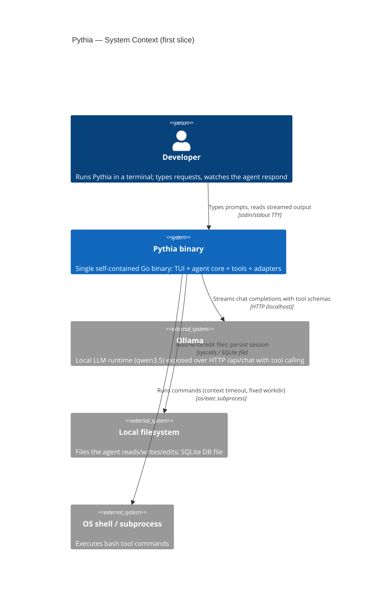
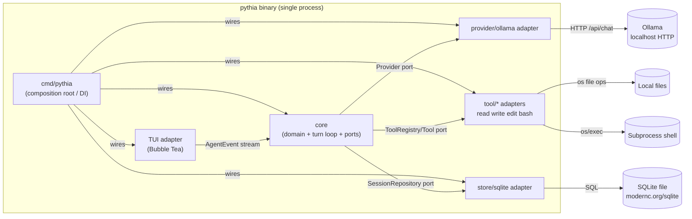
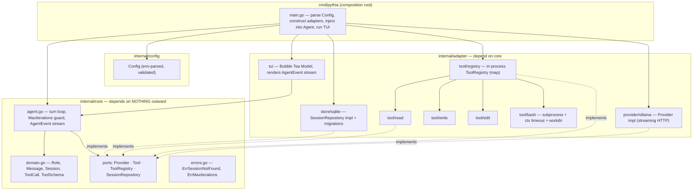

# Pythia — First Vertical Slice Architecture

**Status:** Accepted for build · **Scope:** one thin end-to-end slice only
**Skill:** `compainy:architecture` (C4 + ADR + NFR + threat discipline)
**Related:** [`.ai/stack-profile.md`](../../.ai/stack-profile.md) · [`docs/superpowers/specs/first-slice.md`](../superpowers/specs/first-slice.md) · ADRs [0001](../adr/0001-provider-port-streaming-shape.md) [0002](../adr/0002-tool-registry-seam-future-grpc-plugins.md) [0003](../adr/0003-sqlite-modernc-repository-boundary.md) [0004](../adr/0004-module-package-layout-dependency-rule.md)

This document is the contract the build binds to. It defines the package
topology, the load-bearing port signatures, the non-functional requirements,
and the security requirements for the first slice: a single-binary,
single-user, local TUI agent that reasons via Ollama, calls 4 built-in tools,
and persists a session to SQLite.

Everything here is deliberately proportional to one slice. The two extension
seams (a `Provider` port that admits a future Codex impl; a `Tool`/`ToolRegistry`
seam that admits future out-of-process `hashicorp/go-plugin` gRPC tools) are
*shaped* now and *not built* now (YAGNI).

---

## 1. C4 views

### 1.1 System context



The only network dependency is the local Ollama HTTP endpoint. Filesystem and
shell are trust boundaries the tools cross (see §4).

### 1.2 Container / deployment

There is exactly one deployable unit — the `pythia` binary. In C4 terms the
"containers" are the binary plus the external processes/stores it touches. The
binary is CGO-free so `go build` yields one portable artifact.



Arrows into `core` are through ports (interfaces `core` owns). `core` imports
no adapter package. All wiring happens once in `cmd/pythia`.

### 1.3 Component view — Go package topology



**Dependency rule (the load-bearing invariant):** dependencies point inward.
`internal/core` imports only the standard library. `internal/adapter/*`
imports `internal/core` (to implement its ports and use its domain types) and
third-party libs. `cmd/pythia` imports everything and is the only place they
meet. This is enforced by a fitness function (see §5).

Proposed module path: `github.com/bRRRITSCOLD/pythia`.

```
pythia/
├── cmd/pythia/main.go                # composition root / DI wiring
├── internal/
│   ├── config/config.go              # env → validated Config
│   ├── core/
│   │   ├── domain.go                 # Role, Message, Session, ToolCall, ToolSchema
│   │   ├── provider.go               # Provider port + ChatRequest + StreamEvent
│   │   ├── tool.go                   # Tool + ToolRegistry ports
│   │   ├── session.go                # SessionRepository port
│   │   ├── agent.go                  # turn loop + AgentEvent
│   │   └── errors.go                 # sentinel errors
│   └── adapter/
│       ├── provider/ollama/          # Provider impl
│       ├── tool/registry/            # ToolRegistry impl
│       ├── tool/read|write|edit|bash # Tool impls
│       ├── store/sqlite/             # SessionRepository impl + migrations
│       └── tui/                      # Bubble Tea program
└── docs/{architecture,adr}/
```

---

## 2. Load-bearing port signatures (the contract)

All ports and domain types live in `internal/core`. These signatures are the
binding contract; the build must not silently deviate. Comments state the
behavioral contract each impl must honor.

### 2.1 Domain types (`internal/core/domain.go`)

```go
package core

import (
	"encoding/json"
	"time"
)

// Role is the author of a Message. Values map cleanly onto both the Ollama
// dialect and a stricter future dialect (Codex).
type Role string

const (
	RoleSystem    Role = "system"
	RoleUser      Role = "user"
	RoleAssistant Role = "assistant"
	RoleTool      Role = "tool"
)

// ToolCall is the model's request to invoke one tool during an assistant turn.
type ToolCall struct {
	ID   string          // provider-assigned id; correlates the eventual tool result
	Name string          // registered tool name
	Args json.RawMessage // JSON arguments; validated at the tool adapter boundary
}

// Message is one entry in a session's conversation history. It is the wire
// format between core and every adapter, and the persisted record. A single
// struct carries all roles; unused fields are zero for a given role.
type Message struct {
	ID         string     // stable id (adapter- or core-assigned)
	SessionID  string     // owning session
	Role       Role       // author
	Content    string     // text content; may be empty when an assistant turn is tool-calls-only
	ToolCalls  []ToolCall // set when Role == RoleAssistant and the model requested tools
	ToolCallID string     // set when Role == RoleTool: which ToolCall.ID this result answers
	CreatedAt  time.Time  // ordering key within a session
}

// Session is a single conversation thread.
type Session struct {
	ID        string
	Title     string
	CreatedAt time.Time
	UpdatedAt time.Time
}

// ToolSchema is a tool's self-description, advertised to the Provider so the
// model knows what it may call. Parameters is a JSON-Schema object.
type ToolSchema struct {
	Name        string          // unique tool name the model invokes
	Description string          // natural-language purpose for the model
	Parameters  json.RawMessage // JSON Schema (draft) describing the args object
}
```

### 2.2 Provider port (`internal/core/provider.go`) — streaming is first-class

```go
package core

import "context"

// ChatRequest is one model turn: the full history plus the tools the model may
// call. Providers are stateless w.r.t. history — core always sends the whole
// conversation, so a stricter dialect can re-encode it however it needs.
type ChatRequest struct {
	Messages []Message
	Tools    []ToolSchema
}

// StreamEvent is one incremental output of a single Chat turn. Exactly one of
// {TextDelta present, ToolCalls present + Done, Done, Err} is meaningful per
// event. The stream is ordered: zero or more TextDelta events, then a single
// terminal event (Done, optionally carrying ToolCalls, or Err).
type StreamEvent struct {
	TextDelta string     // a chunk of assistant text to render live
	ToolCalls []ToolCall // delivered on the terminal event when the model requests tools
	Done      bool       // terminal event of the turn; channel closes after
	Err       error      // set on a mid-stream fatal error (terminal)
}

// Provider is the port to an LLM. The sole first-slice impl is Ollama
// (qwen3.5). A future Codex impl binds this exact interface with NO core change.
//
// Contract:
//   - Chat streams one assistant turn over the given history and tool schemas.
//   - The returned channel is closed by the provider after a terminal event.
//   - A connection/setup failure (e.g. Ollama down) is returned as the error;
//     a mid-stream failure arrives as StreamEvent.Err. Core handles both
//     gracefully (surface, do not crash).
//   - ctx cancellation aborts the turn and closes the channel.
//   - A non-streaming provider satisfies the port by emitting one terminal
//     event carrying the full text and/or tool calls.
type Provider interface {
	Chat(ctx context.Context, req ChatRequest) (<-chan StreamEvent, error)
}
```

### 2.3 Tool + ToolRegistry ports (`internal/core/tool.go`) — the plugin seam

```go
package core

import (
	"context"
	"encoding/json"
)

// Tool is one capability the model may invoke. A built-in in-process tool and a
// future out-of-process go-plugin gRPC proxy implement this SAME interface, so
// core is agnostic to in-process vs. out-of-process execution. This is the
// seam; no go-plugin dependency exists in this slice.
//
// Contract:
//   - Schema is stable and advertised to the Provider.
//   - Invoke executes with JSON args and returns a JSON result.
//   - ctx carries the deadline/cancellation (e.g. the bash timeout).
//   - A returned error is an infrastructure/execution failure. A tool that
//     "fails in a way the model should see and react to" (bad path, non-zero
//     exit) returns that in the JSON result with a nil error, so the loop feeds
//     it back to the model rather than aborting the turn.
type Tool interface {
	Schema() ToolSchema
	Invoke(ctx context.Context, args json.RawMessage) (json.RawMessage, error)
}

// ToolRegistry holds the available tools and exposes their schemas to the
// Provider. The first-slice impl is an in-process map. A future impl can merge
// gRPC-plugin tools behind this same interface without touching core.
type ToolRegistry interface {
	Schemas() []ToolSchema        // all advertised schemas, for the Provider
	Get(name string) (Tool, bool) // resolve by name; ok=false if unregistered
}
```

### 2.4 SessionRepository port (`internal/core/session.go`)

```go
package core

import "context"

// SessionRepository persists sessions and their message history. Core depends
// on this port only; the SQLite adapter lives behind it and core never sees SQL.
//
// Contract:
//   - GetSession returns ErrSessionNotFound when absent.
//   - AppendMessage appends one message; ordering is by CreatedAt.
//   - Messages returns the full ordered history for a session (used to resume
//     across restarts and to build each ChatRequest).
type SessionRepository interface {
	CreateSession(ctx context.Context, s Session) error
	GetSession(ctx context.Context, id string) (Session, error)
	AppendMessage(ctx context.Context, m Message) error
	Messages(ctx context.Context, sessionID string) ([]Message, error)
}
```

### 2.5 Agent turn loop (`internal/core/agent.go`)

The Agent is core; it owns the synchronous turn loop and the tool-loop bound.
It emits a UI-facing `AgentEvent` stream so the TUI adapter renders without ever
importing the `Provider` — the TUI depends only on core.

```go
package core

import "context"

// AgentEventType classifies a UI-facing event from the turn loop.
type AgentEventType int

const (
	EventTextDelta        AgentEventType = iota // assistant token(s) to render
	EventToolCallStarted                        // a tool is about to run
	EventToolCallFinished                       // a tool returned
	EventTurnComplete                           // no more tool calls; turn ended
	EventError                                  // fatal error; loop stopped
)

// AgentEvent is what the TUI renders. It hides Provider/Tool details from the UI.
type AgentEvent struct {
	Type       AgentEventType
	TextDelta  string
	ToolCall   *ToolCall
	ToolResult json.RawMessage
	Err        error
}

// AgentOption configures the turn loop.
type AgentOption func(*Agent)

// WithMaxIterations bounds the tool-call loop (default 10). On overflow the loop
// stops with ErrMaxIterations rather than looping forever.
func WithMaxIterations(n int) AgentOption { /* ... */ }

// Agent runs the synchronous turn loop for a session, wiring Provider,
// ToolRegistry, and SessionRepository — all injected as core ports.
type Agent struct{ /* provider, registry, repo, maxIterations */ }

func NewAgent(p Provider, reg ToolRegistry, repo SessionRepository, opts ...AgentOption) *Agent

// Send drives one full user turn:
//  1. persist the user Message
//  2. load history, call Provider.Chat with registry.Schemas()
//  3. stream TextDelta events; collect any ToolCalls at Done
//  4. if tool calls: execute each via registry.Get().Invoke, persist tool
//     result Messages, and re-invoke Provider — up to MaxIterations
//  5. terminate when a turn returns no tool calls (EventTurnComplete)
// All output flows over the returned AgentEvent channel, closed at the end.
func (a *Agent) Send(ctx context.Context, sessionID, userInput string) (<-chan AgentEvent, error)
```

Sentinel errors (`internal/core/errors.go`): `ErrSessionNotFound`,
`ErrMaxIterations`.

---

## 3. Non-functional requirements

This is a local, single-user, single-process TUI. Classic distributed-systems
NFRs (availability targets, sharding, egress cost) do not apply. The NFRs that
*do* constrain the design:

| NFR | Requirement | Design consequence |
|-----|-------------|--------------------|
| **Startup latency** | TUI interactive in < 200 ms cold. | No network or model call at startup. Open SQLite, run migrations, render TUI first; the Ollama connection is lazy — established on first `Send`. |
| **Streaming responsiveness** | First assistant token rendered < 100 ms after Ollama emits it; no perceptible buffering. | Provider streams `TextDelta` events straight through; Agent forwards to the TUI without batching. TUI updates on each event via a Bubble Tea `tea.Cmd`. |
| **Single-binary size discipline** | One `go build` artifact, CGO-free, no runtime deps. Keep binary lean. | Pure-Go deps only (`modernc.org/sqlite`, Bubble Tea). No `go-plugin`/gRPC, no chromem-go in this slice (they add megabytes and are YAGNI). Verified by a "no CGO" build check. |
| **Graceful Ollama-down** | If Ollama is unreachable or dies mid-stream, the TUI shows an error and stays usable; no crash, no corrupted session. | `Provider.Chat` returns setup errors up front and mid-stream errors as `StreamEvent.Err`; Agent maps both to `EventError`; already-persisted user/tool messages remain valid history. |
| **Tool-loop bound** | The agent must not loop on tool calls forever. | `WithMaxIterations` (default 10) hard-caps re-invocations; overflow ends the turn with `ErrMaxIterations` surfaced to the user. |
| **Responsiveness under a slow tool** | A slow/hung tool (esp. bash) must not freeze the UI or run unbounded. | Every `Invoke` receives a `ctx` with a deadline; bash uses a configured timeout. The loop runs off the TUI render goroutine. |
| **Persistence durability** | A session survives process kill and resumes on relaunch. | Each user/assistant/tool message is appended (committed) as it is produced, not buffered until turn end. Resume replays `Messages(sessionID)`. |
| **Testability (fitness)** | Architecture verifiable continuously. | Dependency-direction test, port contract tests, teatest e2e (see §5). |

Concurrency model: one turn loop at a time per session (synchronous, as
resolved in the spec). The TUI renders on Bubble Tea's goroutine; the Agent runs
its loop on a separate goroutine and communicates over the `AgentEvent` channel.
`ctx` cancellation (e.g. user quits) stops the loop cleanly.

---

## 4. Threat pass

Pythia is a local dev tool with **no auth and no multi-tenancy** — the operator
already has a shell. The threat model is therefore *not* "keep the user out"; it
is: **model output, tool output, and bash execution are all untrusted content**,
and untrusted content must not (a) hijack the terminal, (b) escape the intended
working directory, or (c) exhaust local resources. Mitigations are proportional
to a local tool; heavier OS sandboxing is a documented follow-up.

Trust boundaries crossed: Ollama → core (model output), tool subprocess/FS →
core (tool output), core → terminal (rendered output), core → filesystem &
shell (tool actions).

| # | Risk | Vector | Required mitigation (security requirement) |
|---|------|--------|--------------------------------------------|
| **T1** | **Terminal-escape / ANSI injection** | Model text or tool output containing raw escape sequences (cursor control, clipboard OSC 52, hyperlinks, title-set) is rendered verbatim and manipulates the user's terminal or spoofs UI. | **SR-1:** All model text and all tool output are sanitized before rendering — strip/escape C0/C1 control bytes and ANSI/OSC sequences (only styling the TUI itself applies via Lip Gloss is allowed). Untrusted content is rendered as inert text, never interpreted. |
| **T2** | **Path traversal in read/write/edit** | Model supplies `../../etc/passwd`, absolute paths, or symlinks to read or clobber files outside the intended workspace. | **SR-2:** read/write/edit resolve the arg path against the configured working dir, reject absolute paths and `..` escapes, and validate the cleaned path stays within the workspace root (resolve symlinks, then containment-check). Reject on violation with a tool-result error the model sees. |
| **T3** | **Arbitrary command execution via bash** | Model emits any shell command; bash tool runs it. This is the tool's *purpose*, so the goal is bounding blast radius, not forbidding it. | **SR-3:** bash runs in a subprocess with (a) a `ctx` timeout, (b) a fixed configured working directory, (c) no inherited secrets beyond the parent env — do not forward extra credentials. The bash boundary is isolated so the full OS sandbox (landlock + seccomp / gVisor) drops in behind it later. **SR-3a (follow-up, documented):** OS-level sandbox tracked as a separate slice; not in this slice. |
| **T4** | **Resource exhaustion** | Unbounded tool loop (model keeps calling tools), huge file reads (read a multi-GB file into memory), or runaway bash output flood memory/CPU/disk. | **SR-4a:** tool-call loop hard-capped by `WithMaxIterations` (default 10). **SR-4b:** read tool caps bytes read (configurable max, e.g. 1 MiB) and returns a truncation notice. **SR-4c:** bash captures stdout/stderr with a bounded buffer and is killed at the timeout; output beyond the cap is truncated. |
| **T5** | **Tool-argument injection / malformed args** | Model emits malformed or unexpected JSON args to a tool, or args that fail schema. | **SR-5:** every tool validates its decoded args at the adapter boundary (`go-playground/validator` + JSON-Schema shape) before acting; invalid args return a tool-result error, never a panic. |
| **T6** | **SQL injection into persistence** | Model/tool content flows into persisted messages and could break SQL if concatenated. | **SR-6:** the SQLite adapter uses parameterized queries exclusively; no string-built SQL. Content is opaque data, never SQL. |
| **T7** | **Secret leakage into history/logs** | Env secrets or file contents captured by tools get persisted to the SQLite session or logged. | **SR-7 (proportional):** do not log message content at info level; the SQLite DB inherits the user's file permissions (local single-user). No secret redaction required beyond SR-3's "don't forward extra secrets to bash." |

**Security requirements the plan must carry:** SR-1 (terminal-escape
sanitization), SR-2 (workspace path containment), SR-3 (bash subprocess bounds +
isolated boundary for future sandbox), SR-4a/b/c (loop bound, read cap, bash
output/time cap), SR-5 (tool-arg validation), SR-6 (parameterized SQL), SR-7
(no content logging).

> A dedicated `security-architect` pass is warranted before the bash sandbox
> follow-up (SR-3a) is designed, since it introduces real OS-level trust-boundary
> controls. For this slice the mitigations above are sufficient and proportional.

---

## 5. Fitness functions (verify the architecture continuously)

Lightweight automated checks that keep the design true as code grows:

- **Dependency-direction test** — a unit test (or `go list`/`depguard` check)
  asserting `internal/core` imports nothing from `internal/adapter` and no
  third-party runtime libs. This is the enforcement of the §1.3 dependency rule.
- **Port contract tests** — table tests exercising each port's documented
  contract (e.g. `Provider` streams then a single terminal event; a
  non-streaming stub satisfies it; `GetSession` returns `ErrSessionNotFound`).
  These make swapping a Provider or adding a Tool safe without a second impl.
- **CGO-free build check** — CI builds with `CGO_ENABLED=0` and fails if any dep
  pulls in cgo, protecting the single-binary NFR.
- **teatest e2e** — golden-frame test of the TUI: type a prompt, assert streamed
  output and a tool call round-trip against a stub Provider.

---

## 6. What is intentionally NOT here (YAGNI)

- No `hashicorp/go-plugin` / gRPC code — only the `Tool`/`ToolRegistry` seam.
- No Codex provider — only the `Provider` port shape.
- No chromem-go / RAG / memory / skills.
- No OS-level bash sandbox — bounded subprocess now; landlock/seccomp/gVisor is
  a documented follow-up behind the isolated bash boundary (SR-3a).
- No multi-session UI, config files, auth, or networking beyond the local
  Ollama HTTP call.

These are reversible to add later precisely because the seams above are in place.
```
