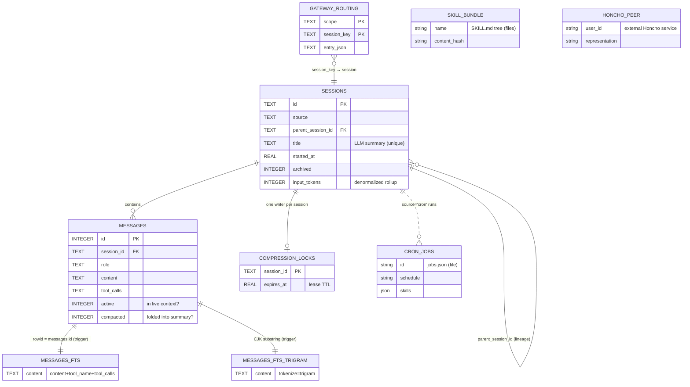

# Hermes Agent — Data Architecture Breakdown

A data-architect's read of **`nousresearch/hermes-agent`** (Nous Research), a self-improving
AI agent framework. Python (~82%) + TypeScript (~14%), MIT.

> **Method.** Every claim below is tagged **[CONFIRMED]** (read from the repo source or the
> official docs at `hermes-agent.nousresearch.com`) or **[INFERRED]** (a data-architect's
> reconstruction where the repo does not spell it out). DDL blocks quoted verbatim from
> `hermes_state.py` are marked as such; DDL I authored to *illustrate an inferred model* is
> labeled "illustrative / inferred".
>
> Primary sources read: `README.md`, `hermes_state.py`, `agent/memory_manager.py`, and docs
> pages for memory, architecture, skills, cron, and personality.

---

## 0. TL;DR for the data architect

Hermes is a **local-first, single-node, file-plus-SQLite** system with **deliberately no
built-in vector store**. It is a textbook case of *the simplest store that satisfies the real
constraint wins*:

| Dataset | Store | Why this store |
|---|---|---|
| Agent memory (`MEMORY.md`) + user profile (`USER.md`) | **Flat Markdown files** | Tiny (≤2,200 / ≤1,375 chars), human-editable, injected verbatim into the prompt prefix. A DB would add nothing. |
| Sessions + messages + full-text recall | **SQLite (`state.db`) + FTS5** | Relational lineage, atomic multi-writer, embedded zero-ops full-text search. |
| Self-improving skills | **Filesystem tree of `SKILL.md` bundles** | Portable (agentskills.io standard), git-diffable, progressive-disclosure friendly. |
| Cron jobs | **`jobs.json` (atomic file write)** | A handful of records, no query needs beyond "load all + tick." |
| User personality model | **Honcho (external service)** + `SOUL.md` file | Dialectic/theory-of-mind modeling delegated to a purpose-built backend. |
| Semantic memory | **Not in core.** Optional external providers (Honcho / Mem0 / Supermemory) | Core stays dependency-light; semantic is opt-in polyglot. |

The interesting architectural tension: a system marketed on "memory that grows across sessions"
holds its **canonical working memory in two size-capped text files** and pushes *recall* into
FTS5 keyword search over raw message history, not embeddings. That is a defensible YAGNI call,
and section 8 sketches what changes if/when semantic recall must be added.

---

## 1. What data the system stores, and why

**[CONFIRMED]** Everything lives under a profile-aware base dir, `HERMES_HOME`
(default `~/.hermes`, `%LOCALAPPDATA%\hermes` on Windows). Profile isolation is a first-class
concept: `hermes -p <name>` gives each profile *its own* `HERMES_HOME`, config, memory,
sessions, and gateway PID. That is the top-level tenancy boundary.

```
$HERMES_HOME/                         # e.g. ~/.hermes  (per-profile root)  [CONFIRMED]
├── config.yaml                       # profile-scoped config                [CONFIRMED]
├── SOUL.md                           # agent identity, prompt slot #1        [CONFIRMED]
├── state.db                          # SQLite: sessions/messages + FTS5      [CONFIRMED]
├── memories/
│   ├── MEMORY.md                     # agent notes, ≤2,200 chars (~800 tok)  [CONFIRMED]
│   └── USER.md                       # user profile,  ≤1,375 chars (~500 tok)[CONFIRMED]
├── skills/
│   ├── <category>/<name>/SKILL.md    # skill bundles (+ references/ etc.)    [CONFIRMED]
│   └── .hub/{lock.json,quarantine/,audit.log}                                [CONFIRMED]
├── pending/skills/                   # staged writes awaiting approval       [CONFIRMED]
├── cron/
│   ├── jobs.json                     # persisted cron jobs (atomic write)    [CONFIRMED]
│   ├── .tick.lock                    # scheduler tick file lock              [CONFIRMED]
│   └── output/{job_id}/{ts}.md       # per-run output logs                   [CONFIRMED]
└── scripts/                          # cron-attachable .sh/.py scripts       [CONFIRMED]
```

Data classes and their purpose:

1. **Working memory** — `MEMORY.md` (environment, conventions, learned lessons) and `USER.md`
   (preferences, communication style). **[CONFIRMED]** Injected into the system prompt as a
   *frozen snapshot at session start* to preserve the LLM's prefix cache; edits persist to disk
   immediately but only surface next session.
2. **Episodic history** — every session and every message (see §3). Enables cross-session
   recall and analytics (token/cost accounting is baked into the schema).
3. **Procedural memory (skills)** — reusable procedures the agent authors from experience (§5).
4. **User model** — Honcho dialectic modeling for personality adaptation (§6).
5. **Schedules** — persisted cron jobs and their run outputs (§7).
6. **Identity + config** — `SOUL.md`, `config.yaml`, `.env` / provider credentials.

---

## 2. Store selection & polyglot-persistence analysis

**[CONFIRMED]** stores in use: SQLite (+FTS5), flat Markdown/JSON files, an external Honcho
service, and optional external memory providers.

The polyglot spread is *justified per dataset*, not maximalist:

- **Files for memory/config/skills** — These are read-mostly, human-authored/human-editable,
  small, and want to be git-diffable and portable. A relational row would obscure them. Skills
  additionally need to travel (agentskills.io portability), which files give for free.
- **SQLite for sessions** — This is the one dataset with real *relational* needs (session↔message
  1:N, session↔session lineage), real *concurrency* (multiple gateway platforms + subagents
  writing at once), and a real *query* need (full-text recall, recency, per-platform filters).
  SQLite in WAL mode + FTS5 covers all three with zero operational surface. **[CONFIRMED]**
- **JSON for cron** — A handful of job records loaded wholesale each 60s tick. No indexing or
  query need → a table would be over-engineering. **[INFERRED rationale; storage CONFIRMED.]**
- **Honcho (external) for the user model** — Theory-of-mind/dialectic modeling is a specialized
  workload with its own backend; Hermes integrates it as a provider rather than reimplementing
  it. **[CONFIRMED integration; Honcho internals external.]**

**Why *not* a single Postgres for everything? [INFERRED]** Hermes is a local, single-user CLI/
gateway daemon. Postgres would impose a server dependency for zero benefit at this scale. The
design correctly refuses to make every additional store "earn its place" — and none of memory/
cron needed a server-grade engine.

**Notable absence — no core vector DB. [CONFIRMED]** Semantic search is *not* in the built-in
memory system; it arrives only via optional external providers (Honcho, Mem0, Supermemory).
See §8 for how I'd add first-party semantic recall.

---

## 3. Session store + FTS5 — the schema (CONFIRMED, verbatim from `hermes_state.py`)

This is the heart of the data model. DDL below is quoted from source.

### 3.1 `sessions` (aggregate root)

```sql
CREATE TABLE IF NOT EXISTS sessions (
    id TEXT PRIMARY KEY,
    source TEXT NOT NULL,                 -- platform: cli, telegram, discord, slack, cron...
    user_id TEXT,
    session_key TEXT,
    chat_id TEXT,
    chat_type TEXT,
    thread_id TEXT,
    display_name TEXT,
    origin_json TEXT,                     -- serialized origin envelope
    expiry_finalized INTEGER DEFAULT 0,
    model TEXT,
    model_config TEXT,
    system_prompt TEXT,
    parent_session_id TEXT,               -- lineage (compression splits, subagent delegation)
    started_at REAL NOT NULL,
    ended_at REAL,
    end_reason TEXT,
    message_count INTEGER DEFAULT 0,
    tool_call_count INTEGER DEFAULT 0,
    input_tokens INTEGER DEFAULT 0,
    output_tokens INTEGER DEFAULT 0,
    cache_read_tokens INTEGER DEFAULT 0,
    cache_write_tokens INTEGER DEFAULT 0,
    reasoning_tokens INTEGER DEFAULT 0,
    cwd TEXT,
    git_branch TEXT,
    git_repo_root TEXT,
    billing_provider TEXT,
    billing_base_url TEXT,
    billing_mode TEXT,
    estimated_cost_usd REAL,
    actual_cost_usd REAL,
    cost_status TEXT,
    cost_source TEXT,
    pricing_version TEXT,
    title TEXT,                           -- <-- LLM-generated session summary/title (see §4)
    api_call_count INTEGER DEFAULT 0,
    handoff_state TEXT,
    handoff_platform TEXT,
    handoff_error TEXT,
    compression_failure_cooldown_until REAL,
    compression_failure_error TEXT,
    rewind_count INTEGER NOT NULL DEFAULT 0,
    archived INTEGER NOT NULL DEFAULT 0,
    FOREIGN KEY (parent_session_id) REFERENCES sessions(id)
);
```

Observations a data architect should note:
- **Self-referential FK** `parent_session_id → sessions.id` models lineage as an adjacency list
  (compression splits and subagent delegation). Good fit; recursive CTE gives full ancestry.
- **Token/cost columns are denormalized onto the session** — a materialized rollup so accounting
  never has to re-scan `messages`. Kept correct via the message write path (§9).
- **Per-platform isolation** is `source` + the gateway-peer tuple, indexed (below).

### 3.2 `messages` (child entity of the session aggregate)

```sql
CREATE TABLE IF NOT EXISTS messages (
    id INTEGER PRIMARY KEY AUTOINCREMENT,
    session_id TEXT NOT NULL REFERENCES sessions(id),
    role TEXT NOT NULL,                   -- user | assistant | tool | system
    content TEXT,
    tool_call_id TEXT,
    tool_calls TEXT,                      -- JSON
    tool_name TEXT,
    timestamp REAL NOT NULL,
    token_count INTEGER,
    finish_reason TEXT,
    reasoning TEXT,
    reasoning_content TEXT,
    reasoning_details TEXT,
    codex_reasoning_items TEXT,
    codex_message_items TEXT,
    platform_message_id TEXT,
    observed INTEGER DEFAULT 0,
    active INTEGER NOT NULL DEFAULT 1,    -- <-- soft-active flag for context compaction
    compacted INTEGER NOT NULL DEFAULT 0  -- <-- message folded into a compression summary
);
```

- `active` / `compacted` implement **context compression without data loss**: compacted messages
  stay on disk (searchable) but drop out of the live context window. This is why recall can reach
  content the running conversation has already evicted.

### 3.3 Full-text search — FTS5 design (CONFIRMED)

Two FTS5 virtual tables, **inline content mode** (no `content=` external-content option — the
indexed text is duplicated into the FTS index):

```sql
-- Default tokenizer (unicode61) for Latin-script search
CREATE VIRTUAL TABLE IF NOT EXISTS messages_fts USING fts5(content);

-- Trigram tokenizer: substring queries for CJK / non-Latin scripts
CREATE VIRTUAL TABLE IF NOT EXISTS messages_fts_trigram USING fts5(
    content,
    tokenize='trigram'
);
```

Index maintenance is trigger-driven, and the triggers **concatenate three columns**
(`content + tool_name + tool_calls`) into the single FTS `content` column so a search hits both
prose *and* tool activity:

```sql
CREATE TRIGGER IF NOT EXISTS messages_fts_insert AFTER INSERT ON messages BEGIN
    INSERT INTO messages_fts(rowid, content) VALUES (
        new.id,
        COALESCE(new.content, '') || ' ' || COALESCE(new.tool_name, '') || ' ' || COALESCE(new.tool_calls, '')
    );
END;

CREATE TRIGGER IF NOT EXISTS messages_fts_delete AFTER DELETE ON messages BEGIN
    DELETE FROM messages_fts WHERE rowid = old.id;
END;

CREATE TRIGGER IF NOT EXISTS messages_fts_update AFTER UPDATE ON messages BEGIN
    DELETE FROM messages_fts WHERE rowid = old.id;
    INSERT INTO messages_fts(rowid, content) VALUES (
        new.id,
        COALESCE(new.content, '') || ' ' || COALESCE(new.tool_name, '') || ' ' || COALESCE(new.tool_calls, '')
    );
END;
```

The `rowid` of each FTS row is deliberately set to `messages.id`, so an FTS hit joins straight
back to the source row. (The trigram table has the same trigger shape.)

Query-side facts **[CONFIRMED]**: input is guarded by `MAX_FTS5_QUERY_CHARS = 2048` and passed
through a `sanitize_context()` helper before a `MATCH`. **[INFERRED]** the retrieval path chooses
the trigram table for CJK/substring queries and the default table otherwise, and ranks by FTS5
`bm25()` (the module exposes no explicit `ORDER BY bm25(...)` in the excerpt I read — treat the
exact ranking as inferred).

**Data-architect critique of the FTS design:**
- *Inline content mode duplicates message text into the index.* For a personal agent that's fine;
  at scale I'd switch to an **external-content (contentless) FTS5** table
  (`content='messages', content_rowid='id'`) to halve storage, accepting the more careful trigger
  discipline it requires. **[INFERRED recommendation.]**
- *Two full FTS tables double index storage.* Reasonable tradeoff for correct CJK substring
  search; unicode61 alone mis-tokenizes CJK.
- The concatenated `tool_calls` JSON in the index means tool arguments are searchable — powerful,
  but a place where prompt-injection-scanned content should be sanitized before indexing.

### 3.4 Supporting tables (CONFIRMED)

```sql
-- Gateway session routing (which session a platform peer maps to)
CREATE TABLE IF NOT EXISTS gateway_routing (
    scope TEXT NOT NULL DEFAULT '',
    session_key TEXT NOT NULL,
    entry_json TEXT NOT NULL,
    updated_at REAL NOT NULL,
    PRIMARY KEY (scope, session_key)
);

-- Advisory locks so only one worker compresses a session at a time
CREATE TABLE IF NOT EXISTS compression_locks (
    session_id TEXT PRIMARY KEY,
    holder TEXT NOT NULL,
    acquired_at REAL NOT NULL,
    expires_at REAL NOT NULL              -- lease TTL → self-healing on crash
);
```

### 3.5 Indexing strategy (CONFIRMED)

```sql
CREATE INDEX IF NOT EXISTS idx_sessions_source        ON sessions(source);
CREATE INDEX IF NOT EXISTS idx_sessions_parent        ON sessions(parent_session_id);
CREATE INDEX IF NOT EXISTS idx_sessions_started       ON sessions(started_at DESC);
CREATE INDEX IF NOT EXISTS idx_messages_session       ON messages(session_id, timestamp);
CREATE INDEX IF NOT EXISTS idx_messages_session_active ON messages(session_id, active, timestamp);
CREATE INDEX IF NOT EXISTS idx_sessions_session_key   ON sessions(session_key, started_at DESC);
CREATE INDEX IF NOT EXISTS idx_sessions_gateway_peer  ON sessions(source, user_id, chat_id, chat_type, thread_id, started_at DESC);
CREATE UNIQUE INDEX IF NOT EXISTS idx_sessions_title_unique ON sessions(title) WHERE title IS NOT NULL;
```

Each index maps to a concrete access pattern: recent-first listing (`started_at DESC`), fetch a
session's live context (`session_id, active, timestamp`), resolve a gateway peer to its latest
session (the 5-column covering index), and enforce unique summaries (partial unique on `title`).
This is access-pattern-first modeling done well.

---

## 4. Session summarization data flow (raw messages → LLM summary → searchable record)

**[CONFIRMED]** the feature ("FTS5 session search with LLM summarization for cross-session
recall") and the storage sink (`sessions.title`, with a partial-unique index). **[CONFIRMED]**
messages are indexed into FTS on insert/update via triggers, so raw history is searchable
immediately, independent of summarization. **[INFERRED]** the exact orchestration (which module
calls the LLM, when) — reconstructed below.

```
                 ┌────────────────────────────────────────────────────────┐
 live turn ──►   │ messages INSERT ──trigger──► messages_fts (+ _trigram)  │  raw recall ready
                 └────────────────────────────────────────────────────────┘
                                        │  (session end / compression / idle)
                                        ▼
                 ┌────────────────────────────────────────────────────────┐
                 │ summarizer: read active messages for session_id         │
                 │   → LLM produces short title/summary                    │
                 │   → UPDATE sessions SET title=?, ... WHERE id=?          │
                 └────────────────────────────────────────────────────────┘
                                        │
                                        ▼
   session_search(query):
     hits = FTS MATCH over messages_fts (bm25 rank) ∪ title LIKE/MATCH
     → group by session_id, join sessions for title/started_at/source
     → return ranked session cards {id, title, started_at, source, snippet}
```

Pseudocode for the write side (**[INFERRED]**, consistent with the confirmed schema):

```python
def finalize_session(session_id: str) -> None:
    msgs = db.query(
        "SELECT role, content FROM messages "
        "WHERE session_id=? AND active=1 ORDER BY timestamp", session_id)
    title = llm.summarize_title(msgs)          # short, unique-ish label
    # partial-unique index on title means collisions must be disambiguated:
    title = ensure_unique_title(title, session_id)
    db.execute("UPDATE sessions SET title=?, ended_at=?, end_reason=? WHERE id=?",
               title, now(), "finalized", session_id)
    # messages_fts already current via triggers — no reindex needed
```

**Design note.** Summarization writes to the *session*, while recall searches the *messages* FTS.
That means recall precision comes from full message history (broad) while the returned "card" uses
the LLM title (readable). A good separation: the expensive LLM call is amortized once per session,
not per search.

---

## 5. Skills — self-improving procedural memory (CONFIRMED)

Skills are **filesystem bundles**, not DB rows. Layout:

```
~/.hermes/skills/
├── mlops/axolotl/
│   ├── SKILL.md            # YAML frontmatter + markdown body
│   ├── references/         # supporting docs loaded on demand
│   ├── templates/
│   ├── scripts/
│   └── assets/
├── software-development/deploy-k8s/SKILL.md
└── .hub/
    ├── lock.json           # resolved versions / integrity
    ├── quarantine/         # untrusted/failed-scan skills held back
    └── audit.log           # provenance & sync audit trail
```

`SKILL.md` frontmatter (**[CONFIRMED]** fields):

```markdown
---
name: my-skill
description: Brief description
version: 1.0.0
platforms: [macos, linux]
# optional conditional-activation metadata:
requires_toolsets: [...]
fallback_for_toolsets: [...]
requires_tools: [...]
fallback_for_tools: [...]
tags: [...]
category: mlops
---
## When to Use
## Procedure
## Pitfalls
## Verification
```

**Versioning & integrity [CONFIRMED].** A `.bundled_manifest` records **content hashes** per
bundled skill. Sync compares hashes to classify each skill as *unchanged* (safe to update) vs.
*user-modified* (flagged, never overwritten). `hermes skills reset <name>` / `--restore` return to
the bundled version. This is effectively **content-addressed optimistic versioning** —
the hash *is* the version identity, and user edits fork the lineage.

**Self-improvement write path [CONFIRMED].** The agent mutates skills via the `skill_manage`
tool: `create | patch | edit | delete | write_file | remove_file`. When
`skills.write_approval: true`, writes stage to `~/.hermes/pending/skills/` for human approval
before committing to the live tree.

**Retrieval / task matching — progressive disclosure [CONFIRMED]:**

```
Level 0  skills_list()  → [{name, description, category}, ...]   (~3k tokens, always cheap)
Level 1  skill_view(name) → full SKILL.md body + metadata        (loaded only when selected)
```

Activation: explicit slash command (`/skill-name`), stacking (`/skill1 /skill2 instruction`),
natural-language match, or conditional metadata (`requires_/fallback_for_toolsets/tools`).

**Data-architect mapping [INFERRED].** The `skills/` tree *is* a denormalized document store; a
lightweight index (the `index-cache` directory seen under `skills/`) plays the role of a
materialized catalog so Level-0 listing doesn't stat-walk the whole tree each turn. If skill count
grew into the thousands or needed fuzzy/semantic matching, I'd project the frontmatter into a
small SQLite catalog table (name, description, category, hash, path, embedding) — see §8.

Illustrative catalog projection (**inferred**, not in repo):

```sql
-- illustrative / inferred: a queryable projection over the SKILL.md tree
CREATE TABLE skill_catalog (
    name         TEXT PRIMARY KEY,
    category     TEXT,
    description  TEXT,
    version      TEXT,
    content_hash TEXT NOT NULL,      -- from .bundled_manifest
    path         TEXT NOT NULL,
    user_modified INTEGER DEFAULT 0,
    updated_at   REAL NOT NULL
);
CREATE VIRTUAL TABLE skill_catalog_fts USING fts5(
    name, description, content='skill_catalog', content_rowid='rowid');
```

---

## 6. Honcho user model (CONFIRMED integration; internals external)

**[CONFIRMED]** Hermes uses **Honcho dialectic user modeling** (Plastic Labs) for cross-session
user understanding and personality adaptation, wired as one of several **memory provider plugins**
(alongside Mem0 and Supermemory) that run *alongside* the built-in file memory, adding semantic
search and knowledge-graph capabilities. Personality itself is also anchored by `SOUL.md` (prompt
slot #1, injection-scanned, never overwritten).

**[INFERRED]** Honcho is a *separate service* with its own persistence (Plastic Labs' Honcho is a
Postgres-backed user-context/theory-of-mind store exposing workspaces → peers/sessions →
messages, plus a "dialectic" endpoint that answers questions about the user). Hermes therefore
does **not** own this schema; it calls Honcho over its API and treats returned facts as recalled
context. This is clean **polyglot boundary discipline**: the user model is a bounded context owned
by an external system, integrated by reference, not by sharing tables.

Illustrative view of what Honcho holds on Hermes' behalf (**inferred external model**):

```
workspace (the Hermes deployment)
 └── peer (a user)
      ├── sessions / messages  (dialogue Honcho observes)
      └── representation        (derived theory-of-mind facts, queried via /dialectic)
```

Integration path through `agent/memory_manager.py` (**[CONFIRMED]** signatures):

```python
# read: pull user-model context from every provider before/around a turn
def prefetch_all(self, query: str, *, session_id: str = "") -> str: ...
#   → wrapped by build_memory_context_block(raw) into a <memory-context> fenced block

# write: push the completed turn to providers on a background thread (non-blocking)
def sync_all(self, user_content, assistant_content, *, session_id="", messages=None) -> None: ...
_MIRRORED_MEMORY_ACTIONS = {"add", "replace", "remove"}
```

Recalled provider text is fenced (`<memory-context>…</memory-context>`) and scrubbed
(`StreamingContextScrubber`, `sanitize_context()`) so a provider cannot smuggle instructions into
the model as if they were user input — a **data-provenance / trust-boundary** control at the
persistence edge.

---

## 7. Cron job store (CONFIRMED)

**[CONFIRMED]** Jobs persist to `~/.hermes/cron/jobs.json` via **atomic file writes**; the gateway
daemon ticks every **60s**, guarded by a `~/.hermes/cron/.tick.lock` file lock so overlapping ticks
can't double-fire. Each run's output is written to `~/.hermes/cron/output/{job_id}/{timestamp}.md`
(permanent local log, independent of delivery success). `model`/`provider` are stored as `null`
unless per-job overrides are set. Jobs can attach ≥0 skills and scripts (`~/.hermes/scripts/`,
`.sh`/`.bash` via bash, else Python; default timeout 3600s, `HERMES_CRON_SCRIPT_TIMEOUT`).

Schedule formats **[CONFIRMED]**: relative one-shot (`30m`,`2h`,`1d`), intervals (`every 30m`…),
cron expressions (`0 9 * * *`), ISO timestamps (`2026-03-15T09:00:00`). Delivery targets:
`origin | local | telegram | discord | slack | email | sms | all`.

Illustrative `jobs.json` record (**structure inferred**, fields confirmed individually):

```json
{
  "jobs": [
    {
      "id": "job_9f2c",
      "prompt": "Generate the daily ops report",
      "schedule": "0 9 * * *",
      "schedule_kind": "cron",
      "skills": ["software-development/report"],
      "scripts": ["collect_metrics.py"],
      "delivery": ["telegram"],
      "continuable": true,
      "model": null,
      "provider": null,
      "next_run_at": 1789700400.0,
      "last_run_at": 1789614000.0,
      "enabled": true
    }
  ]
}
```

**Data-architect note.** JSON-file storage is right at this cardinality (tens of jobs, full load
per tick). The single scaling smell is that run *history* lives as `.md` files on disk with no
index — fine for humans, but "when did job X last succeed?" requires a directory walk. If job
observability mattered, I'd add a `cron_runs(job_id, started_at, status, output_path, cost_usd)`
SQLite table. **[INFERRED recommendation.]**

---

## 8. Vector / embedding modeling — NOT in core (CONFIRMED absence) + how I'd add it

**[CONFIRMED]** The built-in memory system is **file + FTS5 keyword search only**. There is *no*
first-party embedding column, vector index, or ANN store. Semantic capability is available **only**
through optional external providers (Honcho / Mem0 / Supermemory). This is a legitimate YAGNI call:
keyword FTS over full message history covers a large fraction of "did we talk about X" recall with
zero model-serving cost or dimensional-index maintenance.

**[INFERRED] If first-party semantic recall were required**, the lowest-friction, stack-consistent
path is **`sqlite-vec`** (or `sqlite-vss`) *inside the existing `state.db`* — keeping the
single-file, zero-ops property intact rather than introducing a server-grade vector DB:

```sql
-- illustrative / inferred: semantic recall co-located in state.db via sqlite-vec
CREATE VIRTUAL TABLE messages_vec USING vec0(
    message_id INTEGER PRIMARY KEY,
    embedding  FLOAT[768]            -- match the chosen embedding model's dim
);
-- populate on message insert (chunk long messages first), same trigger discipline as FTS
```

Hybrid retrieval (recommended over pure ANN) — fuse FTS5 lexical rank with vector similarity via
Reciprocal Rank Fusion:

```python
def hybrid_recall(query, k=20):
    lexical = fts_search(query, k)                       # bm25 over messages_fts
    q_emb   = embed(query)
    semantic = vec_search(q_emb, k)                      # KNN over messages_vec
    return rrf_fuse(lexical, semantic)                   # RRF: 1/(60+rank) summed per doc
```

**When to reach for `pgvector` instead [INFERRED]:** only if Hermes moved off single-node/local to
a multi-tenant server deployment (many users, shared corpus, HA). At that point sessions would
migrate SQLite→Postgres anyway, and `pgvector` (HNSW index, `vector_cosine_ops`) would ride along.
Until that constraint is real, adding a vector server would violate "every store must earn its
place."

Chunking/embedding design **[INFERRED default]**: chunk messages to ~256–512 tokens with ~15%
overlap, embed at write time on the same background worker that already runs `sync_all`, store
`{message_id, chunk_ix, embedding}`, and cap re-embedding via the content hash so edits don't
re-embed unchanged text.

---

## 9. Read/write paths (pseudocode)

### Memory write (`memory` tool: add / replace / remove) — CONFIRMED semantics

```python
# MEMORY.md ≤ 2200 chars, USER.md ≤ 1375 chars; errors (not truncation) on overflow.
def memory_tool(action, target_file, *, text=None, old_text=None):
    doc = read(f"~/.hermes/memories/{target_file}")           # MEMORY.md | USER.md
    if action == "add":       new = doc + "\n" + text
    if action == "replace":   new = doc.replace(old_text, text)   # substring match
    if action == "remove":    new = doc.replace(old_text, "")
    reject_if_injection_or_exfil(new)                          # security scan before accept
    if len(new) > LIMIT[target_file]:
        return error("over capacity — consolidate/remove entries")   # >80% ⇒ nudge to curate
    atomic_write(target_file, new)                            # persists now; visible next session
```

### Session + message write — CONFIRMED schema, INFERRED sequencing

```python
def append_message(session_id, role, content, *, tool_name=None, tool_calls=None, tokens=None):
    with db.write_lock():                                     # WAL: one writer, many readers
        db.execute("""INSERT INTO messages
            (session_id, role, content, tool_name, tool_calls, timestamp, token_count, active)
            VALUES (?,?,?,?,?,?,?,1)""",
            session_id, role, content, tool_name, tool_calls, now(), tokens)
        # AFTER INSERT trigger maintains messages_fts (+ _trigram) automatically
        db.execute("""UPDATE sessions
            SET message_count = message_count + 1,
                input_tokens  = input_tokens  + ?,            -- keep denormalized rollups correct
                output_tokens = output_tokens + ?
            WHERE id = ?""", in_tok, out_tok, session_id)
```

### Session search (cross-session recall) — CONFIRMED feature, INFERRED query

```python
def session_search(query, k=10, cjk=False):
    query = sanitize_context(query)[:MAX_FTS5_QUERY_CHARS]     # 2048
    tbl = "messages_fts_trigram" if cjk else "messages_fts"
    return db.query(f"""
        SELECT s.id, s.title, s.source, s.started_at,
               snippet(m_fts, 0, '[', ']', '…', 12) AS snippet
        FROM {tbl} m_fts
        JOIN messages m ON m.id = m_fts.rowid
        JOIN sessions s ON s.id = m.session_id
        WHERE m_fts MATCH ?
        ORDER BY bm25(m_fts)                                   -- ranking: INFERRED
        LIMIT ?""", query, k)
```

### Skill retrieval — CONFIRMED progressive disclosure

```python
def choose_skill(task):
    catalog = skills_list()                # Level 0: name/description/category, ~3k tokens
    hit = match(task, catalog)             # slash-cmd, NL match, or requires/fallback metadata
    if hit: return skill_view(hit.name)    # Level 1: full SKILL.md loaded only now
```

---

## 10. ER diagram (CONFIRMED core + INFERRED extensions)



Solid lines = enforced relational edges inside `state.db` (**CONFIRMED**). Dotted lines = logical
edges to file/external stores that are *not* FK-enforced (**INFERRED linkage**).

---

## 11. Data integrity, concurrency, retention, backup

**Concurrency [CONFIRMED].** SQLite in **WAL mode** = concurrent readers + a single writer, sized
exactly for the multi-platform gateway (Telegram/Discord/Slack/cron all writing). **Atomic writes
with contention handling** are called out for sessions. `compression_locks` is a **leased advisory
lock** (has `expires_at`) so exactly one worker compresses a session and a crashed holder's lock
self-expires rather than deadlocking. The cron `.tick.lock` file lock serializes scheduler ticks.
Memory/skills/jobs use **atomic file replace** to avoid torn writes. Multiple subagents writing
concurrently are safe because: (a) each owns its own `session_id` rows, (b) FK + WAL serialize the
single writer, (c) shared mutations (compression) are lock-gated.

**Integrity [CONFIRMED].** FK `messages.session_id → sessions.id` and self-FK for lineage;
partial-unique index on `sessions.title`; trigger-maintained FTS can't drift from source rows;
`add/replace/remove` memory writes are validated (`_memory_tool_result_succeeded` requires
`success and not staged`). **[INFERRED gap]** No `ON DELETE CASCADE` is shown on
`messages.session_id`; deleting a session likely relies on application-level cleanup — I'd add an
explicit cascade or a retention job to prevent orphan messages/FTS rows.

**Retention / consolidation — "agent-curated memory" [CONFIRMED].** There is no TTL sweeper; memory
is curated *by the agent* under hard character caps. On overflow the store **errors instead of
truncating**, forcing the agent to consolidate; docs prescribe proactive consolidation above **80%
capacity**, reinforced by "periodic nudges." Episodic history is retained but **compacted**
(`active=0`, `compacted=1`) so it leaves the context window while staying searchable. `archived`
on sessions supports soft archival. This is *curation as a first-class data lifecycle*, replacing a
mechanical retention policy — a deliberate design choice, not an omission.

**Backup [INFERRED].** Because everything is under one `HERMES_HOME`, backup = snapshot that
directory. The correct-but-easy-to-get-wrong part: **`state.db` must be backed up WAL-aware** — use
`sqlite3 .backup` / `VACUUM INTO`, or checkpoint before copying; a naive file copy mid-write can
capture a torn DB + orphaned WAL. Files (`MEMORY.md`, `SKILL.md` tree, `jobs.json`) are
snapshot-safe as-is. Honcho data lives in the external service and is backed up separately —
another reason its bounded-context boundary matters.

---

## 12. DDD / aggregate-to-schema mapping

| Bounded context | Aggregate root | Invariant / transactional boundary | Store |
|---|---|---|---|
| **Conversation** | `Session` (root) with `Message` children | A message only exists within a session; token/cost rollups on the root stay consistent with its messages; compaction toggles `active/compacted` atomically. One aggregate ⇒ one write transaction. | `state.db` (CONFIRMED) |
| **Recall / search** | `messages_fts` projection | Read model derived from `messages` via triggers; never written directly. | `state.db` FTS5 (CONFIRMED) |
| **Working memory** | `MemoryDocument` (`MEMORY.md`/`USER.md`) | Size-capped, injection-scanned, atomic replace. | files (CONFIRMED) |
| **Procedural memory** | `Skill` bundle | Content-hash identity; user edits fork; approval gate before commit. | files (CONFIRMED) |
| **User model** | `UserRepresentation` | Owned by Honcho — integrated by reference, never a shared table. | external (CONFIRMED) |
| **Scheduling** | `CronJob` | Whole-file load/replace; runs are append-only logs. | `jobs.json` (CONFIRMED) |

The key DDD win Hermes gets right: **the user model is a separate bounded context behind a service
boundary**, not a table Hermes reaches into. And the Session aggregate keeps its root and children
in a single SQLite transaction — no aggregate spans two stores. Repositories (`memory_provider`,
`memory_manager`, `hermes_state`) hide the store choice behind method calls, so domain code doesn't
import SQL or the Honcho client directly — Dependency-Inversion at the persistence edge.

---

## 13. Data-architect verdict

Hermes' persistence is **appropriately minimal and well-matched to its constraints**. The
standouts: FTS5 over full (including compacted) message history for cheap keyword recall; trigger-
maintained inline FTS with a dedicated trigram table for CJK; leased advisory locks for safe
multi-writer compression; content-hash skill versioning; and a disciplined external boundary for
the Honcho user model. The load-bearing YAGNI calls — no core vector store, JSON for cron, files
for memory — are correct at this scale.

Highest-value evolutions when/if scale demands (all **[INFERRED]**): (1) switch FTS5 to
external-content mode to stop duplicating message text; (2) add `sqlite-vec` for first-party hybrid
semantic recall before reaching for any server-grade vector DB; (3) add a `cron_runs` table for job
observability; (4) make `messages.session_id` cascade-delete explicit; (5) if Hermes ever goes
multi-tenant/server, migrate sessions SQLite→Postgres and bring `pgvector` along in the same move.
```
