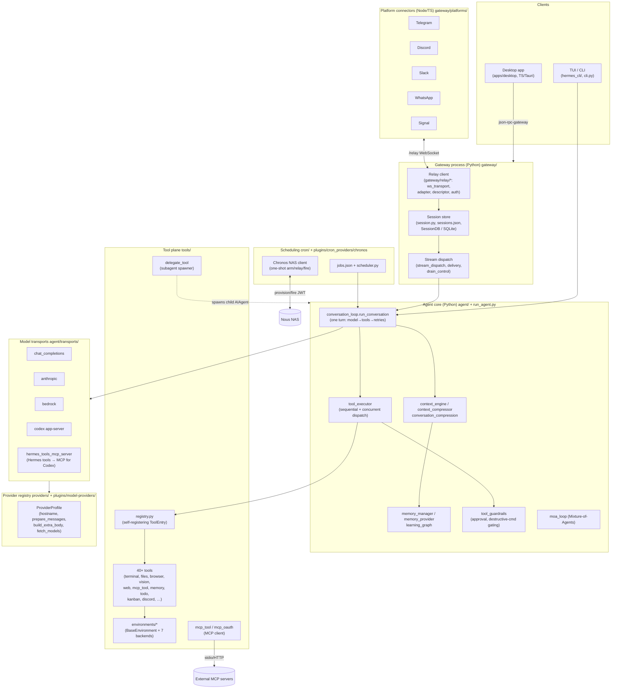
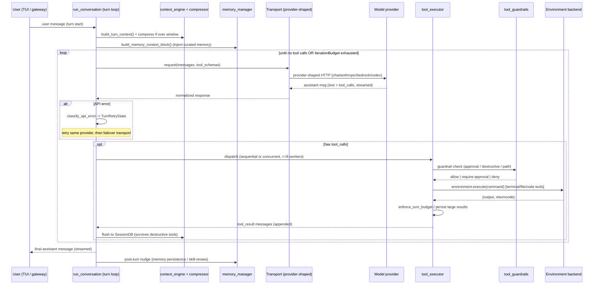

# Hermes Agent — Systems Architecture Breakdown

**Subject:** `NousResearch/hermes-agent` — "the self-improving AI agent built by Nous Research."
**Perspective:** Staff systems architect. Topology, boundaries, control flow, NFRs, tradeoffs, ADRs.
**Method:** Grounded in the repository's README, `docs/`, and directly-inspected source (`tools/environments/base.py`, `tools/delegate_tool.py`, `agent/conversation_loop.py`, `providers/`, `gateway/relay/`, `cron/`, `agent/transports/hermes_tools_mcp_server.py`, `tools/registry.py`). Every claim I could not verify from source or docs is explicitly tagged **[INFERENCE]**.

> Language mix: Python ~82% (agent core, tools, gateway, providers, cron), TypeScript ~14% (`apps/desktop` Tauri-style desktop UI + `gateway` platform connectors), the rest auxiliary. The architectural center of gravity is Python; TypeScript sits at two edges — the desktop/web UI and the per-platform messaging connectors.

---

## 1. What the system actually is (one paragraph)

Hermes is a **single-tenant, long-lived agent process** that wraps a model provider in a tool-calling loop, and then wraps *that* loop in three orthogonal abstraction layers so the same agent can (a) run its shell/tool side-effects on any of seven execution backends (local, Docker, SSH, Singularity, Modal, managed-Modal, Daytona), (b) talk to any model provider without code changes, and (c) be reached from any messaging platform through a normalized relay. On top of the loop sit four "self-improvement" subsystems — agent-curated memory, session FTS5 search + LLM summarization, autonomously-created skills, and a scale-to-zero cron scheduler. The design bet is that **one agent binary should be portable across cost/compute regimes** ("$5 VPS, a GPU cluster, or serverless infrastructure that costs nearly nothing when idle") by pushing every environment-specific concern behind an interface.

---

## 2. C4 — Level 1: System Context

```
                          ┌──────────────────────────────────────────────┐
     Human users          │                                              │
  (Telegram / Discord /   │              HERMES AGENT                     │
   Slack / WhatsApp /  ───┼──▶  A self-improving, model-agnostic,         │
   Signal / CLI / TUI /   │     tool-calling agent that executes work     │
   Desktop app)           │     on pluggable compute backends.           │
                          │                                              │
                          └───┬───────────┬───────────┬─────────┬────────┘
                              │           │           │         │
                    ┌─────────▼──┐  ┌─────▼─────┐ ┌───▼─────┐ ┌─▼───────────┐
                    │ Model      │  │ Execution │ │ Nous    │ │ External    │
                    │ providers  │  │ backends  │ │ Portal  │ │ tool/data   │
                    │ (Portal/   │  │ (Docker/  │ │ + NAS   │ │ services    │
                    │ OpenRouter/│  │ SSH/Modal/│ │ (cron   │ │ (Firecrawl, │
                    │ OpenAI/    │  │ Daytona/  │ │ relay,  │ │ Browserbase,│
                    │ Anthropic/ │  │ Singular- │ │ billing,│ │ MCP servers,│
                    │ Bedrock/…) │  │ ity/local)│ │ models) │ │ Honcho, …)  │
                    └────────────┘  └───────────┘ └─────────┘ └─────────────┘
```

**Key external actors and why they are external:**

- **Model providers** — the reasoning substrate. Deliberately *not* embedded; selected at runtime (`hermes model` / `/model provider:model`).
- **Execution backends** — where the agent's side effects (shell, files, browsers) physically run. Isolated from the control plane so the agent can be homeless w.r.t. compute.
- **Nous Portal / NAS (Nous Agent Service)** — hosted control-plane services: model gateway ("300+ models"), the **Chronos** external one-shot cron relay, and billing/credits.
- **External tool services** — Firecrawl (web search/extract), Browserbase/Camofox (browser), Honcho (dialectic user modeling), arbitrary **MCP servers**.

---

## 3. C4 — Level 2: Container Diagram

A "container" here = an independently-runnable process or a cohesive deployable module. The repo tree maps cleanly onto these.



**Container responsibilities (bounded contexts):**

| Container | Owns | Ubiquitous language | Talks to |
|---|---|---|---|
| **CLI/TUI** (`hermes_cli/`, `cli.py`, `run_agent.py`) | Interactive front door, slash-commands, setup/doctor | *command, session, turn* | Agent core directly (in-process) |
| **Gateway** (`gateway/`) | Session lifecycle, message normalization consumption, delivery, drain/scale-to-zero | *session_key, MessageEvent, drain, resume* | Connectors (WS), Agent core |
| **Platform connectors** (`gateway/platforms/`, TS) | Platform crypto, webhook verification, capability descriptors, token vault | *CapabilityDescriptor, SessionSource, inbound/outbound op* | Gateway (WS back-channel), platform APIs |
| **Agent core** (`agent/`, `run_agent.py`) | The turn loop, context/memory management, tool orchestration, MoA | *conversation, turn, context window, compression, delegation* | Transports, Tool plane |
| **Model transports** (`agent/transports/`) | Wire-level model I/O per API shape | *transport, stream, tool schema projection* | Provider registry, external model APIs |
| **Tool plane** (`tools/`) | Tool registration, execution, environments, MCP client, subagents | *ToolEntry, toolset, environment, delegate* | Execution backends, external services |
| **Provider registry** (`providers/`, `plugins/model-providers/`) | Provider metadata + request-shaping hooks | *ProviderProfile* | Transports (read-only) |
| **Scheduling** (`cron/`, `plugins/cron_providers/chronos`) | Job store, next-fire computation, at-most-once fire | *job, one-shot, fire, dedup_key* | NAS, Agent core |

The seams are clean and DDD-coherent: **the model API shape** (transports), **the provider identity** (registry), and **the compute location** (environments) are three *separate* axes, each with its own abstract base and plugin directory. That orthogonality is the single most important architectural property of the codebase.

---

## 4. C4 — Level 3: Agent-core components & the turn loop

The heart is `agent/conversation_loop.py::run_conversation(agent, ...)` — described in-source as "the roughly 3,900-line `run_conversation` body that drives one user turn through the agent (model call, tool dispatch, retries, fallbacks, compression, post-turn hooks, background memory/skill review nudges)."

### 4.1 Control flow (verified components)

Components that participate in one turn, from the imports and docstrings in `conversation_loop.py` and siblings:

- `agent/turn_context.build_turn_context` — assembles the turn's working set.
- `agent/iteration_budget.IterationBudget` — bounds tool-call iterations within a turn.
- `agent/turn_retry_state.TurnRetryState` + `agent/error_classifier.classify_api_error` (`FailoverReason`) — retry/failover state machine across providers/transports.
- `agent/conversation_compression.conversation_history_after_compression` + `context_compressor` — mid-turn context-window management.
- `agent/memory_manager.build_memory_context_block` — injects agent-curated memory into the prompt.
- `agent/message_sanitization.*` — repairs interrupted tool sequences, strips surrogates/non-ASCII, repairs malformed tool-call arguments (defensive against provider quirks).
- `tools/tool_executor` — `_execute_tool_calls_sequential` and `_execute_tool_calls_concurrent` (up to `_MAX_TOOL_WORKERS = 8`).
- `tools/tool_guardrails.ToolGuardrailDecision` — approval / destructive-command gating before execution.

### 4.2 Agent-loop sequence diagram



### 4.3 Agent-loop pseudocode (grounded in the real symbol names)

```python
def run_conversation(agent, user_message):
    ctx      = build_turn_context(agent, user_message)
    budget   = IterationBudget(agent)                 # bounds tool iterations
    retry    = TurnRetryState()
    messages = agent.history + [user_message]

    # 1. Context-window management BEFORE the first model call
    messages = conversation_history_after_compression(agent, messages)
    messages = build_memory_context_block(agent) + messages   # curated memory injected

    while not budget.exhausted():
        # 2. Model call through the provider-shaped transport (with failover)
        try:
            resp = agent.transport.request(messages, tools=agent.tool_schemas)
        except APIError as e:
            reason = classify_api_error(e)             # -> FailoverReason
            if retry.should_retry(reason):
                agent.transport = retry.next_transport_or_same(agent)  # failover
                continue
            raise

        messages.append(resp.assistant_message)

        # 3. Terminal condition: model produced no tool calls
        if not resp.tool_calls:
            break

        # 4. Tool dispatch — sequential OR concurrent (<= _MAX_TOOL_WORKERS=8)
        if agent.should_run_concurrent(resp.tool_calls):
            results = _execute_tool_calls_concurrent(agent, resp.tool_calls,
                                                     timeout=_DEFAULT_CONCURRENT_TOOL_TIMEOUT_S)
        else:
            results = _execute_tool_calls_sequential(agent, resp.tool_calls)

        messages.extend(results)
        _flush_messages_to_session_db(agent, messages)   # survive destructive tools
        budget.tick()

    # 5. Post-turn hooks: memory-persistence nudge + autonomous skill review
    agent.run_post_turn_hooks(messages)
    return messages[-1]
```

Each tool call inside `_execute_tool_calls_*` runs the guardrail gate first:

```python
def execute_one_tool_call(agent, call):
    decision = tool_guardrails.evaluate(call)          # ToolGuardrailDecision
    if decision.requires_approval and not agent.auto_approve:
        approved = agent.request_approval(call)        # DM pairing / TUI prompt
        if not approved:
            return make_tool_result_message(call, "denied by user")
    entry   = registry.get_entry(call.name)            # ToolEntry (schema, handler, check_fn)
    raw     = entry.handler(**call.args)               # may hit an Environment backend
    result  = maybe_persist_tool_result(raw)           # offload huge outputs
    return make_tool_result_message(call, result)
```

**Notable robustness details actually in the code:** incremental `SessionDB` flushing *between* tool calls so a "destructive-but-valid" tool (e.g. `reboot`, `hermes` self-update) cannot lose the transcript; per-tool-result budgets scaled to the *current* model's context window (`budget_for_context_window` — "a 65K-token local model switched into mid-session gets a budget proportional to its window so a single large tool result can't push the request past the model's limit").

---

## 5. Execution-backend abstraction (the portability core)

This is the cleanest abstraction in the system and deserves a section. Source: `tools/environments/base.py`.

### 5.1 The contract

`BaseEnvironment(ABC)` defines a **unified spawn-per-call execution model**, quoting the module docstring:

> "Unified spawn-per-call model: every command spawns a fresh `bash -c` process. A session snapshot (env vars, functions, aliases) is captured once at init and re-sourced before each command. CWD persists via in-band stdout markers (remote) or a temp file (local)."

The *entire* backend surface a new environment must implement is just **two methods**:

```python
class BaseEnvironment(ABC):
    _stdin_mode: str = "pipe"     # "pipe" | "heredoc"  (Modal/Daytona use heredoc)
    _snapshot_timeout: int = 30   # override for slow cold-starts

    def _run_bash(self, cmd_string, *, login=False,
                  timeout=120, stdin_data=None) -> ProcessHandle: ...   # MUST override
    @abstractmethod
    def cleanup(self): ...                                             # release container/instance/conn

    # Provided by the base class for ALL backends:
    def init_session(self): ...   # capture login-shell env into a snapshot file once
    def execute(self, command, cwd="", *, timeout=None,
                stdin_data=None) -> dict:   # returns {"output": str, "returncode": int}
```

`execute()` is a **template method**: it prepares the command (sudo transform, compound-background rewrite to dodge the `A && B &` subshell-wait trap), decides `login` vs snapshot sourcing, wraps CWD tracking, calls the subclass's `_run_bash`, waits with interrupt/timeout handling, then updates persisted CWD. Backends only supply *how a bash process is spawned*; the base owns *what a session means*.

`ProcessHandle` is a `typing.Protocol` (`poll`, `kill`, `wait`, `stdout`, `returncode`) so a local `subprocess.Popen` and a remote `_ThreadedProcessHandle` are interchangeable — classic **Dependency Inversion at the boundary**.

### 5.2 The seven backends

From `tools/environments/`: `local.py`, `docker.py`, `ssh.py`, `singularity.py`, `modal.py` + `managed_modal.py` + `modal_utils.py`, `daytona.py`, plus `file_sync.py`. Host-side sandbox storage (`docker workspaces`, `singularity overlays/SIF cache`) roots at `{HERMES_HOME}/sandboxes/` (override `TERMINAL_SANDBOX_DIR`).

### 5.3 How one interface fans out (pseudocode)

```python
# A tool never knows which backend it is on. It asks for "the active env".
def terminal_tool(command: str):
    env = get_active_env()          # tools.terminal_tool -> a BaseEnvironment subclass
    return env.execute(command)     # template method; backend-specific _run_bash under it

# Backend selection (config-driven) — INFERENCE on the exact factory name,
# but the shape is dictated by BaseEnvironment's constructor (cwd, timeout, env):
def make_environment(cfg) -> BaseEnvironment:
    backend = {
        "local":       LocalEnvironment,
        "docker":      DockerEnvironment,
        "ssh":         SSHEnvironment,
        "singularity": SingularityEnvironment,
        "modal":       ModalEnvironment,        # _stdin_mode = "heredoc"
        "managed_modal": ManagedModalEnvironment,
        "daytona":     DaytonaEnvironment,      # _stdin_mode = "heredoc"
    }[cfg.backend]
    env = backend(cwd=cfg.cwd, timeout=cfg.timeout, env=cfg.env)
    env.init_session()              # capture snapshot once
    return env
```

**Why spawn-per-call rather than a persistent PTY?** A persistent interactive shell would be simpler to *reason about* but requires a live connection per session — fatal for serverless backends (Modal/Daytona) that scale to zero and for crash recovery. Spawn-per-call + a re-sourced snapshot file makes every command **stateless at the transport level** while preserving the *illusion* of a stateful shell (env vars, functions, aliases, CWD). That is what lets the same tool code run identically on a local laptop and a cold-started Modal container. The cost is per-command process spawn overhead and the CWD-marker machinery — an explicitly-accepted tradeoff (see ADR-002).

### 5.4 Liveness across slow backends

`base.py` carries a thread-local **activity callback** (`set_activity_callback`, `touch_activity_if_due`) fired at a 10s cadence from `_wait_for_process`. Purpose: a long-running remote/cold-start command can report liveness back to the gateway so a WhatsApp/Discord turn doesn't look hung. This is an environment→gateway backpressure/heartbeat seam that many agent frameworks lack.

---

## 6. Tool execution layer, tool-RPC, and MCP

### 6.1 Registration model

`tools/registry.py`: **self-registering tools**. Each tool module calls `registry.register(...)` at import time, producing a `ToolEntry` (`name, toolset, schema, handler, check_fn`). `discover_builtin_tools()` AST-scans `tools/` for top-level `registry.register(...)` calls and imports only those modules. `check_fn` gates availability (cached via `_check_fn_cached`), and tools are grouped into **toolsets** with alias support (`register_toolset_alias`) — that grouping is what `hermes tools` enables/disables and what subagents restrict against.

Plugins can override built-ins under a governance policy (`register_plugin_override_policy`, `_plugin_owner_of`) so a plugin can't silently hijack a core tool without `override=True`.

### 6.2 The tool-RPC path (Python scripts calling tools)

The README's headline capability — "Write Python scripts that call tools via RPC, collapsing multi-step pipelines into zero-context-cost turns" — is the important one for a systems view. The point: instead of the model emitting N sequential tool calls (each round-tripping through the context window and costing tokens), the model writes **one script** that invokes tools directly, and only the script's *final result* re-enters the context.

The mechanism is realized through two surfaces I verified:

1. **`code_execution_tool` / `execute_code`** runs a script inside the active Environment; the script imports a Hermes RPC client that reaches back into the running agent's tool registry.
2. **`agent/transports/hermes_tools_mcp_server.py`** — a stdio **MCP server that re-exposes Hermes' own tools** to a spawned Codex subprocess. Its docstring is the clearest statement of the RPC boundary and its *limits*:

> "This module exposes a curated subset of those Hermes tools to the spawned codex subprocess via stdio MCP. … What we DO NOT expose: … `delegate_task / memory / session_search / todo` — they require the running `AIAgent` context to dispatch (mid-loop state), so a stateless MCP callback can't drive them."

That single comment reveals the RPC design's central constraint: **tools split into stateless (safely callable out-of-process via RPC/MCP — web_search, browser, vision, image_gen, TTS, kanban) vs. loop-stateful (must run inside the live `AIAgent` — delegation, memory writes, cross-session search, todo).** The RPC surface is deliberately the *stateless subset*.

```
   ┌─────────────────────── Hermes agent process ───────────────────────┐
   │  run_conversation (owns AIAgent state)                             │
   │        │ model writes a script                                     │
   │        ▼                                                           │
   │  execute_code  ──▶  Environment.execute("python script.py")        │
   │                          │                                         │
   │        ┌─────────────────┘  script imports hermes rpc client       │
   │        ▼                                                           │
   │  RPC endpoint (in-proc) ──▶ registry.get_entry(name).handler(...)  │
   │        │   (STATELESS tools only: web/browser/vision/image/tts)    │
   │        ▼                                                           │
   │  result returned to script; script prints ONE summary             │
   └───────────────────────────────────────────────────────────────────┘
        Net effect: 1 turn, 1 context entry, N tool invocations.
```

**[INFERENCE]** The exact wire format of the in-process RPC (Unix socket vs. loopback HTTP vs. named pipe) is not fully visible from the files I read; the *contract* (stateless-subset only, results collapse to one context entry) is explicit in source. The desktop app uses a JSON-RPC gateway (`apps/shared/src/json-rpc-gateway.ts`, `apps/desktop/src/lib/gateway-rpc.ts`) for its UI↔agent channel, which is a separate RPC than the script-tool RPC.

### 6.3 MCP integration (two directions)

- **As MCP client:** `tools/mcp_tool.py`, `tools/mcp_oauth.py`, `tools/mcp_oauth_manager.py` connect *out* to any external MCP server ("Connect any MCP server for extended capabilities"). OAuth is first-class, implying hosted/authenticated MCP servers are a supported case. `optional-mcps/` ships curated servers.
- **As MCP server:** `hermes_tools_mcp_server.py` exposes Hermes tools *in* to a Codex subprocess. So Hermes is simultaneously an MCP host and an MCP provider — MCP is used as the *interop bus between heterogeneous agent runtimes*, not just as a plugin loader.

---

## 7. Messaging gateway architecture

Two processes, two languages, one WebSocket. Source: `docs/relay-connector-contract.md`, `gateway/relay/*`, `docs/session-lifecycle.md`.

### 7.1 Topology and the one-way dial

```
  Platform (Discord/TG/Slack/WA/Signal)
        │  webhooks, platform crypto, tokens
        ▼
  ┌───────────────── Connector (Node/TS, gateway/platforms/*) ─────────────┐
  │ - verifies webhook signatures, decrypts payloads (SOLE crypto owner)   │
  │ - normalizes wire event -> MessageEvent                                │
  │ - holds token VAULT; binds shared-identity capability, strips it out   │
  │ - CapabilityDescriptor (char limits, markdown dialect, edit/thread…)   │
  └───────────────▲───────────────────────────────────────────────────────┘
                  │  gateway DIALS OUT to connector's /relay WS
                  │  (handshake + outbound ops down; inbound events up
                  │   as back-channel frames on the SAME socket)
  ┌───────────────┴──────────── Gateway (Python, gateway/) ────────────────┐
  │ relay/ws_transport, adapter, descriptor, auth (per-gateway HMAC)       │
  │ session.py: build_session_key(SessionSource) -> session_key/session_id │
  │ SessionStore(_entries) + sessions.json + SessionDB(SQLite transcript)  │
  │ stream_dispatch / delivery / drain_control (scale-to-zero)             │
  └───────────────┬────────────────────────────────────────────────────────┘
                  ▼
            Agent core (run_conversation)
```

**Why the gateway dials the connector (not vice-versa):** eliminates the need for the gateway to expose any inbound HTTP endpoint — "critical for hosted/containerized deployments." A containerized/serverless gateway can live behind NAT with no ingress; it opens one outbound WS and receives inbound events as back-channel frames. This is the same architectural instinct as the Chronos cron design (§9): **avoid requiring public ingress on the agent.**

### 7.2 The trust boundary (this is a security-architecture handoff point)

The contract is explicit that **the connector is the sole crypto authority**:

> "The connector alone verifies webhook signatures and decrypts payloads… The gateway performs zero platform crypto verification and trusts normalized inbound events."

And that outbound side-effects never carry raw tokens — the gateway sends `op` dicts keyed by `session_key` + capability `kind`; "the connector resolves the real value from its vault, enforces the tenant match… the gateway has nothing to retry with, by design." Channel auth is a **per-gateway HMAC** on WS upgrade, not per-message signing.

> Architect's note: this is a textbook trust-boundary decomposition and I would pull in **security-architect** to own the threat model for it. The highest-severity risk is already named in-repo: `build_session_key()` must include Discord `guild_id` or "two servers collide into one session" (cross-tenant data bleed). That is a canonical multi-tenant isolation bug and belongs in the threat model as a P1.

### 7.3 Session lifecycle (state machine)

`get_or_create_session()` resolves in strict priority order (from `session-lifecycle.md`):

```
inbound MessageEvent(SessionSource)
   ├─ suspended?      → hard reset (new session_id)
   ├─ resume_pending? → soft recovery (preserve session_id)
   ├─ policy expired? → auto-reset (idle timeout OR daily boundary)
   └─ else            → return existing entry, bump timestamp
```

Crash recovery is real and interesting: on startup the gateway checks a `.clean_shutdown` marker; if missing, `suspend_recently_active(max_age_seconds=120)` marks recently-active sessions `resume_pending`, and the mark "survives until the next successful turn completes." A **stuck-loop guard** suspends a session entirely after 3 consecutive restarts. Storage is triple-tiered: in-memory `_entries`, `sessions.json` for cross-restart state, `SessionDB` SQLite for the transcript.

### 7.4 Scale-to-zero primitives

`going_idle` / `going_idle_ack` (gateway signals drain; connector buffers inbound durably), a `wakeUrl` poke when a buffered-only instance gets its first event, and ack-gated reconnect drain so an event landing in the flip window is "delivered live, not lost." Multi-instance routing uses Redis pub/sub — the connector instance holding the WS delivers; others no-op.

---

## 8. Provider-abstraction / model-agnostic layer

Two-axis design that is easy to conflate but is deliberately split:

**Axis A — Provider identity** (`providers/`): `base.py` defines a `ProviderProfile` dataclass with overridable hooks — `get_hostname()`, `prepare_messages()`, `build_extra_body()`, `fetch_models()` — plus an `OMIT_TEMPERATURE` sentinel for providers that reject a temperature field. `__init__.py` is a **registry** (`register_provider`, `get_provider_profile`, `list_providers`) that "every downstream layer reads from" — single source of truth for provider metadata. Concrete providers live as **plugins** under `plugins/model-providers/<name>/` (Copilot, Kimi-coding[-cn], Zai, OpenRouter, Qwen, Gemini, Bedrock, Anthropic, custom).

**Axis B — Wire protocol / API shape** (`agent/transports/`): `chat_completions.py` (OpenAI-shaped), `anthropic.py`, `bedrock.py`, `codex*` (the Codex app-server runtime that "owns the loop"). `base.py` is the transport interface; `types.py` the shared schemas.

```
   /model provider:model
          │
          ▼
   get_provider_profile("openrouter")  ──▶ ProviderProfile
          │  hostname, prepare_messages, build_extra_body, fetch_models
          ▼
   select Transport by API shape  ──▶ ChatCompletionsTransport | AnthropicTransport | ...
          │
          ▼
   Transport.request(profile.prepare_messages(msgs),
                     extra_body=profile.build_extra_body(...),
                     base_url=profile.get_hostname())
```

The value: adding a provider = drop a `ProviderProfile` plugin; adding a *new API dialect* = add a transport. Most new providers reuse the chat-completions transport and only supply a profile — which is why "300+ models" is tractable. Failover (§4) crosses transports via `TurnRetryState`, so a provider outage can fall back to another wire protocol mid-turn.

There is also `agent/moa_loop.py` (Mixture-of-Agents) and `plugin_llm.py` — Hermes can aggregate multiple models per turn, not just route to one. **[INFERENCE]** MoA appears to be an optional per-turn strategy (multiple provider calls aggregated) rather than the default path, based on the test names (`test_moa_loop_mode`, `test_moa_aggregator_*`).

---

## 9. Subagent spawning & parallelization

Source: `tools/delegate_tool.py`. This is the parallelization model and it is well-specified.

> "Spawns child AIAgent instances with isolated context, restricted toolsets, and their own terminal sessions. Supports single-task and batch (parallel) modes. The parent blocks until all children complete."

Each child gets: a **fresh conversation** (no parent history), its own `task_id` (⇒ its own terminal/Environment session and file-ops cache), a **restricted toolset**, and a focused system prompt. Crucially: "The parent's context only sees the delegation call and the summary result, never the child's intermediate tool calls or reasoning." That is the *context-economics* payoff — delegation is how the parent stays under its context budget while fanning out work.

**Hard isolation invariant — children can never do these** (`DELEGATE_BLOCKED_TOOLS`):

```python
DELEGATE_BLOCKED_TOOLS = frozenset([
    "delegate_task",  # no recursive delegation  -> bounded fan-out depth = 1
    "clarify",        # no user interaction       -> children are non-interactive
    "memory",         # no writes to shared MEMORY.md -> no shared-state races
    "send_message",   # no cross-platform side effects
    "execute_code",   # children reason step-by-step, not via scripts
    "cronjob",        # can't schedule work in the parent's name
])
```

```
        parent AIAgent (run_conversation)
                │ delegate_task([goalA, goalB, goalC])   (batch/parallel)
     ThreadPoolExecutor
        ├── child AIAgent(task_id=a, toolset=restricted, env=own session)
        ├── child AIAgent(task_id=b, …)
        └── child AIAgent(task_id=c, …)
                │  each: fresh conversation, own terminal, blocked tools stripped
                ▼  parent BLOCKS on all futures (with timeout diagnostics)
        summaries only  ──▶ re-enter parent context (not the transcripts)
```

**Architectural read:** the fan-out is **depth-1 by construction** (no recursive delegation) — a deliberate KISS/safety cap that prevents exponential subagent explosions and unbounded cost. Isolation is process-of-thought level (separate `AIAgent` + separate Environment `task_id`), not OS-process level, so fault isolation is *logical* (a child failing returns an error summary; there are explicit timeout-diagnostic tests) rather than a hard sandbox. If a child needs true OS isolation it would run its Environment on Docker/Modal — the two abstractions compose.

---

## 10. Scheduling / automation (Chronos)

Source: `docs/chronos-managed-cron-contract.md`, `cron/`, `plugins/cron_providers/chronos/`.

The clever bit: Hermes does **not** keep an in-process ticker for hosted deployments, because that would prevent scale-to-zero. Instead:

> "Chronos enables hosted Hermes gateways to scale to zero while idle. Instead of maintaining an in-process ticker, the agent requests NAS to arm exactly one external one-shot per job at its computed next-fire time, then wakes only when that fire occurs."

**Three-hop fire, with a fresh short-lived JWT minted per fire:**

```
jobs.json (cron/scheduler.py computes next_run_at)
   │  Hop1: agent → NAS   POST /api/agent-cron/provision   {fire_at, callback_url, dedup_key}
   ▼
NAS arms exactly ONE external one-shot
   │  Hop2: scheduler → NAS  POST /api/agent-cron/relay   (scheduler signature)
   ▼
NAS mints JWT (aud=agent:{instance_id}, purpose=cron_fire)
   │  Hop3: NAS → agent   POST {callback_url}/api/cron/fire   (bearer)
   ▼
agent claims job via store-level compare-and-set  ──▶ runs a turn ──▶ delivers to any platform
   │  recurring: re-arm; one-shot: mark done; repeat.times=N: delete at limit
```

**At-most-once** is enforced by a store-level CAS claim ("Duplicate relay calls find the claim taken and are dropped"). **Self-healing:** the agent reconciles desired-vs-armed jobs on startup, after mutations, and after fires — "No periodic wake occurs." Jobs are authored in natural language ("Daily reports, nightly backups, weekly audits… running unattended") and delivered through the same gateway as interactive turns.

**Architectural read:** this is the same design philosophy as the gateway's outbound-dial — **externalize the timekeeper so the agent needs no always-on process and no public ingress that it initiates**. The idempotency contract (`dedup_key` + CAS + per-fire JWT with narrow `aud`/`purpose`) is genuinely well thought out; it survives duplicate relays, missed fires, and restarts. Cost per idle job ≈ zero. The dependency is NAS (a Nous-hosted service) — self-hosters presumably fall back to `cron/scheduler.py`'s in-process path (there is a `scheduler_provider.py` and a `plugins/cron_providers/` seam, so **[INFERENCE]** the ticker vs. Chronos choice is a pluggable provider).

---

## 11. Non-functional properties & tradeoffs

| NFR | How Hermes achieves it | Tradeoff / cost accepted |
|---|---|---|
| **Portability** | `BaseEnvironment` spawn-per-call + snapshot; 7 backends behind 2 methods; `HERMES_HOME` relocatable install | Per-command spawn overhead; CWD-marker complexity; heredoc-vs-pipe stdin quirks per backend |
| **Cost / scale-to-zero** | Chronos external one-shots; gateway drain + wakeUrl; serverless backends idle-cheap | Requires NAS for hosted cron; cold-start latency on Modal/Daytona (mitigated by activity heartbeat) |
| **Model-agnosticism** | Two-axis provider(profile)/transport(wire) split + registry; cross-transport failover | Two abstractions to keep in sync; MoA multiplies per-turn cost |
| **Context economy** | Subagent delegation (summaries only re-enter context); script-RPC (N calls → 1 context entry); compression + FTS5 recall | Delegation hides child reasoning from the parent (debuggability); compression is lossy |
| **Fault isolation** | Subagents = fresh conversation + own `task_id`/env; incremental SessionDB flush survives destructive tools; stuck-loop guard (3 restarts → suspend) | Subagent isolation is *logical*, not OS-level, unless composed with a container backend |
| **Availability / recovery** | `.clean_shutdown` marker + `resume_pending` soft recovery; triple-tier session storage; CAS job claim | Recovery correctness hinges on the 120s suspend window and marker discipline |
| **Multi-platform reach** | Relay one-way dial + CapabilityDescriptor + normalized `MessageEvent`; Redis pub/sub multi-instance | Connector is a second language (TS) + a hard trust boundary to get right (guild_id P1 risk) |
| **Security posture** | Connector-only crypto; token vault; `op`-by-`session_key` (no raw tokens on gateway); per-fire narrow-aud JWT; command approval; DM pairing; `DELEGATE_BLOCKED_TOOLS`; `url_safety`/`threat_patterns`/`tirith_security`/`osv_check`/`path_security` | Large tool surface (40+) = large attack surface; needs a dedicated threat model (delegate to security-architect) |

**Overall stance:** this is a **pragmatic, evolution-friendly monolith with plugin seams**, not a microservice mesh. The agent core is a single Python process; everything that *must* be elsewhere for cost/portability/security reasons (compute, model, platform crypto, timekeeping) is pushed behind a narrow interface with a plugin directory. That is the correct call for a single-tenant personal agent: it keeps the common path in-process and fast, while making the *expensive/variable* concerns swappable. The main scaling ceiling is that the agent core is one process per user/tenant — horizontal scale is "run more agents," not "shard one agent" (appropriate for the personal-agent domain).

---

## 12. Architecture Decision Records

### ADR-001 — Three orthogonal abstraction axes: provider, transport, environment

**Status:** Accepted (as-built).
**Context.** An agent that must run on "a $5 VPS, a GPU cluster, or serverless" and use "Nous Portal, OpenRouter, OpenAI, your own endpoint" faces three *independent* sources of variation: (1) which model, (2) what API dialect that model speaks, (3) where side-effects physically execute. Collapsing these into one abstraction (e.g. "a backend") forces an N×M×K explosion and couples model choice to compute choice.
**Decision.** Split into three axes, each with its own abstract base + plugin registry: `providers/ProviderProfile` (identity + request shaping), `agent/transports/*` (wire protocol), `tools/environments/BaseEnvironment` (compute location). A turn composes one of each. Failover operates on the transport axis; `/model` switches the provider axis; config switches the environment axis — none touches the others.
**Consequences.**
- (+) Adding a model = a profile plugin (reuses chat-completions transport) → "300+ models" stays tractable.
- (+) Compute is independent of model — same agent on laptop or Modal, any provider.
- (+) Cross-transport failover mid-turn is possible because identity ≠ wire shape.
- (−) Two abstractions (profile + transport) can drift; contributors must know which axis a change belongs to.
- (−) The Codex app-server transport "owns the loop," which breaks the uniform assumption and forced a *whole extra subsystem* (`hermes_tools_mcp_server.py`) to re-inject Hermes tools. Runtime-owns-loop transports are a leak in this abstraction.

### ADR-002 — Stateless spawn-per-call execution with a re-sourced session snapshot

**Status:** Accepted (as-built).
**Context.** Tools need a shell that behaves statefully (env vars, functions, aliases, CWD persist across commands), but the execution substrate ranges from a persistent local machine to serverless containers that scale to zero and can vanish between commands. A persistent PTY per session is simplest to reason about but cannot survive cold-starts, crashes, or scale-to-zero.
**Decision.** Every command spawns a fresh `bash -c`. Capture the login-shell environment into a snapshot file once at `init_session()`; re-source it before each command. Persist CWD via an in-band stdout marker (remote) or temp file (local). Backends implement only `_run_bash()` + `cleanup()`; the base `execute()` template method owns session semantics, sudo/compound-background rewriting, interrupt/timeout, and CWD tracking.
**Consequences.**
- (+) The *same tool code* runs on all 7 backends; new backends are ~2 methods.
- (+) Survives cold-starts, crashes, and scale-to-zero — there is no long-lived shell to lose.
- (+) Enables incremental SessionDB flush and destructive-command survival (state isn't trapped in a live process).
- (−) Per-command process-spawn + snapshot-source overhead on every call.
- (−) Real complexity leaks: `_stdin_mode` heredoc-vs-pipe per backend, Windows Git-Bash CWD quoting, the `A && B &` subshell-wait rewrite. The docstrings are full of these scars — the abstraction is leaky at the edges even though the interface is clean.

### ADR-003 — Externalize timekeeping and inbound reachability (Chronos + one-way relay dial)

**Status:** Accepted (as-built).
**Context.** For hosted deployments the agent should cost "nearly nothing when idle," which rules out an always-on ticker and rules out requiring public inbound HTTP (both force an always-warm, ingress-exposed process). Yet the agent must still fire scheduled jobs and receive platform messages.
**Decision.** (a) Cron: the agent computes `next_run_at` and asks NAS to arm exactly one external one-shot per job; NAS wakes the agent via an authenticated callback with a short-lived, narrow-`aud` JWT at fire time. At-most-once via `dedup_key` + store-level CAS claim; self-heal by reconciliation on startup/mutation/fire. (b) Messaging: the gateway *dials out* to the connector's `/relay` WebSocket and receives inbound events as back-channel frames, so the gateway needs no inbound endpoint.
**Consequences.**
- (+) True scale-to-zero: idle cost ≈ 0; no ticker, no ingress on the agent.
- (+) Robust idempotency and self-healing survive duplicate relays, missed fires, restarts.
- (+) Containerized/NAT'd gateways work with zero exposed ports.
- (−) Hard dependency on NAS for hosted cron (a Nous-operated control plane) — a centralization/lock-in point; self-hosters need the in-process `scheduler_provider` fallback.
- (−) More moving parts and more auth surface (three hops, per-fire JWT minting, HMAC WS upgrade) than a naive in-process cron — justified only because idle-cost and no-ingress are hard requirements. Classic reversibility-vs-simplicity call resolved in favor of the operational NFRs.

---

## 13. Open questions / where I'd dig next (for a follow-up review)

1. **Exact script-RPC wire format** — socket vs. loopback HTTP vs. pipe (I verified the *contract* — stateless-subset only — not the transport). Load-bearing for security review.
2. **MoA cost/latency defaults** — is Mixture-of-Agents opt-in per turn or a default path? Affects the cost NFR materially.
3. **Self-improving skills feedback loop** — `skills/`, `skill_bundles`, `skill_commands`, `skills_guard`, agentskills.io compatibility exist, but the *trigger* for autonomous skill creation ("after complex tasks") and the write-back safety gates (`skills_guard.py`) deserve their own review — this is the one subsystem that lets the agent modify its own future behavior, so it is the highest-leverage risk.
4. **Honcho dialectic user modeling** (`memory_provider`, `docs/design/profile-builder.md`) — external dependency for long-term user memory; its trust boundary and data-retention posture belong in the threat model.
5. **`agent/pet/`** — undocumented; unknown purpose. Worth identifying before it becomes load-bearing.

---

*Delegations recommended:* **security-architect** owns the connector trust boundary, the `guild_id` multi-tenant P1, the skills self-write gates, and the Chronos/JWT auth chain. **data-architect** owns the triple-tier session store (in-mem / `sessions.json` / SQLite `SessionDB`) + FTS5 search schema and the memory/learning-graph model.
