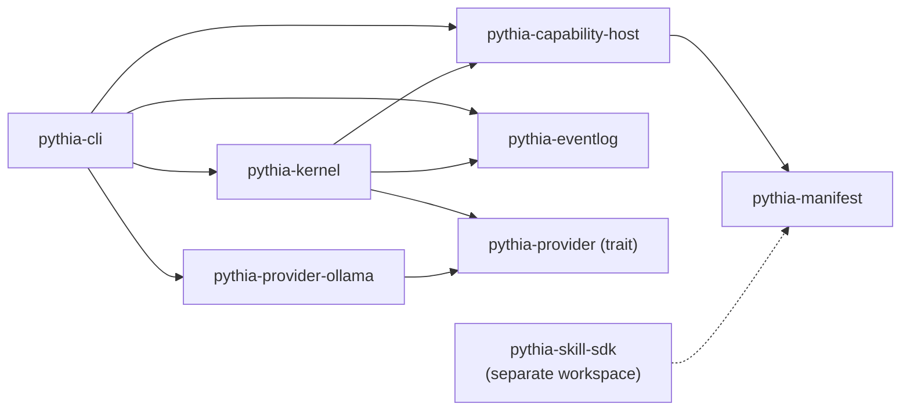
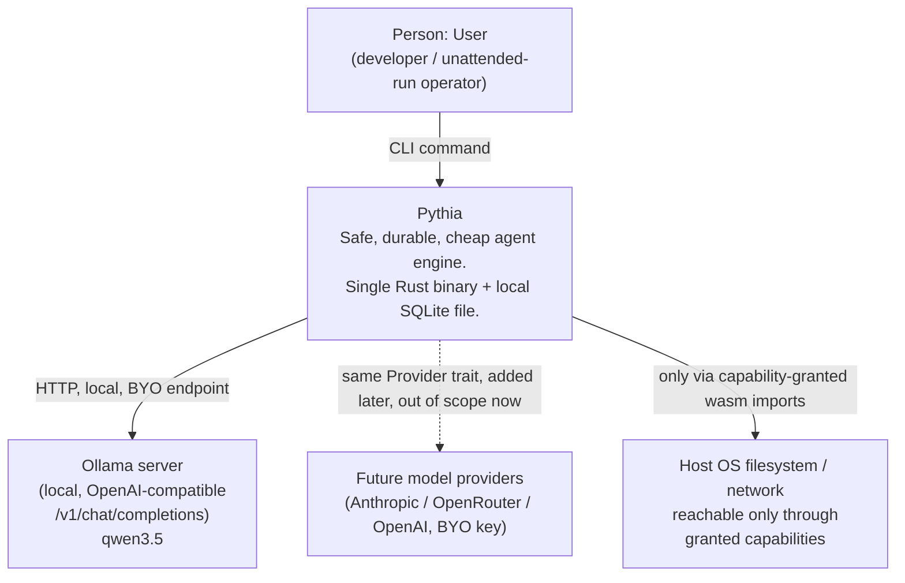
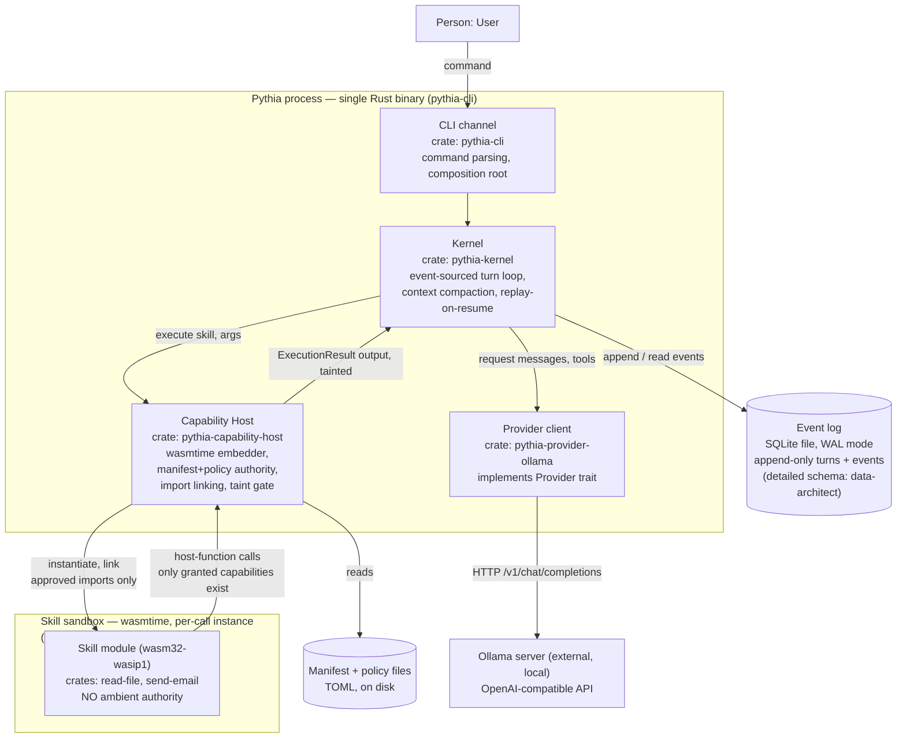

# Pythia — Architecture (Phase 1)

**Date:** 2026-07-10
**Status:** Design only — no code, no scaffolded crates. Feeds the implementation plan for the first
vertical slice.
**Inputs:** `docs/superpowers/specs/2026-07-10-pythia-engine-design.md` (approved design, locked
constraints), `docs/reference/hermes-systems-architecture.md` (+ `-data-architecture.md`,
`-security-architecture.md`) — the reference system this design differentiates from.
**Decisions recorded as ADRs:** `docs/adr/0001`–`0006` (see index at the end of this document).

---

## 1. Scope of this document

This is the Phase 1 architecture for the four units (kernel, event log, capability host, skill
runtime), the provider seam, and the CLI channel, sized for the **first vertical slice** defined in
the spec (§6): a thin thread through all four units, proving durability (crash-resume without
double-executing effects) and safety (capability isolation with no ambient authority) end-to-end,
shallowly. Everything explicitly out of scope in the spec (self-authoring, semantic memory,
multi-tenant isolation, agent-graph depth, messaging gateway/cron, path-B CLI wrapping, tiered cost
routing) is out of scope here too. No new scope is introduced.

---

## 2. Bounded contexts / crate boundaries

Seven crates in one Cargo workspace (native), plus a second, separate workspace for the WASI-target
skills (kept separate deliberately — see §3). Each crate has one owning responsibility and its own
ubiquitous language, per DDD bounded-context practice.

| Crate | Owns | Ubiquitous language | Depends on | Depended on by |
|---|---|---|---|---|
| `pythia-manifest` | Capability identifier vocabulary; skill manifest schema (request); policy schema (authority) | *capability, manifest, policy, grant, request* | `serde`, `toml` | `capability-host`, `skill-sdk` (skills workspace) |
| `pythia-eventlog` | Append-only event envelope; SQLite/WAL storage; replay cursor / read-from-seq | *envelope, seq, effect_result, tainted, replay cursor* | `rusqlite` | `kernel` |
| `pythia-provider` | `Provider` trait; wire-agnostic `Message`/`ToolSchema`/`ToolCall`/response-chunk types | *provider, message, tool schema, tool call, response chunk* | `serde` | `kernel`, `provider-ollama` |
| `pythia-provider-ollama` | Ollama OpenAI-compatible HTTP implementation of `Provider` | *chat completion, endpoint, model name* | `pythia-provider`, `reqwest`, `tokio` | `cli` (composition root only) |
| `pythia-capability-host` | wasmtime embedder; Linker construction from manifest+policy; per-call skill instantiation; taint propagation | *capability host, grant, import, taint, execution result* | `pythia-manifest`, `wasmtime` | `kernel` |
| `pythia-kernel` | Turn-loop orchestration; typed event vocabulary (`UserCommand`/`LlmResponse`/`ToolResult`/`TurnComplete`) translated to/from the log envelope; replay-on-resume; context-window compaction | *turn, step, replay, compaction* | `pythia-eventlog`, `pythia-provider` (trait only), `pythia-capability-host` | `cli` |
| `pythia-cli` | Command parsing; composition root (wires concrete `OllamaProvider` + SQLite path + manifest/policy paths into the kernel); the single input surface | *command, invocation* | `pythia-kernel`, `pythia-provider-ollama`, `pythia-capability-host`, `pythia-eventlog` | — (binary) |

**Skills workspace** (`skills/`, separate from the root workspace, see §3):

| Crate | Owns | Depends on |
|---|---|---|
| `pythia-skill-sdk` | Skill-side bindings: declare a manifest, call granted host imports ergonomically | `pythia-manifest` |
| `skills/read-file`, `skills/send-email` (illustrative, matching the spec §5 data-flow example) | Hand-written skill logic | `pythia-skill-sdk` |

### Dependency direction (must stay acyclic)



The kernel never depends on a concrete provider implementation (only the trait) and never depends on
the skills workspace. `pythia-cli` is the only crate that knows all concrete types — it is the
composition root, matching Dependency Inversion at the architectural boundary.

### Why `Provider` is a trait but `EventStore`/`SkillExecutor` are not

This is a deliberate, principle-grounded asymmetry, not an oversight:

- **`Provider` is a real seam today.** The spec names multiple anticipated implementations
  (Ollama now; Anthropic / OpenRouter / OpenAI BYO-key later) as a stated design goal, and the cost
  thesis depends on being able to swap or route between them without touching the kernel. One
  interface, multiple real implementers, justifies the trait now (ADR-0005).
- **The event log and capability host have exactly one implementation each in this slice**, and nothing
  in the spec anticipates a second. Introducing a kernel-internal port trait for either (`EventStore`,
  `SkillExecutor`) with a single implementer would be a layer that adds no logic — the crate boundary
  itself is already the seam, and a second implementation (if it ever appears) can have a trait
  retrofitted around it at that time. This is YAGNI applied to an internal abstraction, not to the
  external crate boundary, which stays real either way.

### Cargo workspace layout

```
pythia/
├── Cargo.toml                    # workspace: members = ["crates/*"]
├── crates/
│   ├── manifest/                 # pythia-manifest
│   ├── eventlog/                 # pythia-eventlog
│   ├── provider/                 # pythia-provider
│   ├── provider-ollama/          # pythia-provider-ollama
│   ├── capability-host/          # pythia-capability-host
│   ├── kernel/                   # pythia-kernel
│   └── cli/                      # pythia-cli (binary)
├── skills/                       # separate workspace, wasm32-wasip1 target
│   ├── Cargo.toml
│   ├── skill-sdk/                # pythia-skill-sdk
│   ├── read-file/
│   └── send-email/
└── docs/
    ├── adr/
    └── superpowers/
        ├── specs/
        └── architecture/
```

## 3. Why two Cargo workspaces, not one

Skills compile to `wasm32-wasip1`; every other crate compiles to the host target. Rust workspaces
share one `Cargo.lock` and feature-unify across all members by default, which makes mixing a
wasm32-wasip1-only crate into the same workspace as native crates a recurring source of accidental
target/feature bleed (and slows `cargo build --workspace` with cross-target confusion). A second,
separate workspace rooted at `skills/`, depending on `pythia-manifest` via a path dependency across
the directory boundary, keeps the two target universes cleanly separated with no build-graph
surprises. This is a KISS call: two small workspaces are easier to reason about than one workspace
with per-member target overrides.

---

## 4. C4 diagrams

### 4.1 Level 1 — System context



### 4.2 Level 2 — Container diagram

A "container" below is a crate / logical module inside the single `pythia-cli` OS process, except
where noted. The only genuine sub-process trust boundary is the wasmtime sandbox.



**Read on the diagram:** the kernel never talks to the skill sandbox directly — it goes through the
capability host, which is the only crate that constructs a wasmtime `Linker`. The event log has no
edge to the capability host — journaling is exclusively the kernel's responsibility (ADR-0001,
ADR-0002), which keeps "what happened" and "what is allowed" as separate concerns even though both
ultimately gate the same skill call.

---

## 5. Non-functional requirements

| NFR | How the architecture achieves it | Primary ADR / crate |
|---|---|---|
| **Durability** (crash-resume correctness) | Kernel treats the event log as the sole source of turn state; every step is journaled before the kernel proceeds; replay rule — an event with a recorded `effect_result` is a fact, never re-run; kernel holds no state that isn't reconstructible from the log | ADR-0002, ADR-0004; `pythia-kernel`, `pythia-eventlog` |
| **Safety** (capability isolation) | WASM has no ambient authority; capability host links only imports both requested (manifest) and granted (policy); a denied capability is an *absent* import, not a runtime permission check; tainted data reaching a high-privilege tool requires an explicit policy gate. This architecture guarantees only the ambient-authority boundary (capability *presence*) by construction — capability-*argument* safety (e.g. a legitimately-granted `net:smtp` skill tricked by injected content into emailing the wrong recipient), fail-open/fail-closed default policy, and host-function/WASI-FFI implementation hardening are a second, explicit layer specified in `docs/superpowers/security/pythia-threat-model.md`, not a free byproduct of the sandbox | ADR-0003; `pythia-capability-host`, `pythia-manifest` |
| **Cost** (local-model-first) | `Provider` trait decouples the kernel from any vendor; first and default implementation targets a local Ollama model at zero marginal inference cost; BYO-key constraint keeps every implementation subscription-free by construction | ADR-0005; `pythia-provider`, `pythia-provider-ollama` |
| **Latency** | In-process trait dispatch between kernel, host, and provider client (no RPC hop between units); wasmtime executes skills near-native via Cranelift JIT; local Ollama avoids network round-trip to a hosted provider | ADR-0003, ADR-0005 |
| **Portability** | Single statically-linkable Rust binary + one relocatable SQLite file + wasmtime-compiled skills; no external services (no gateway, connector fleet, NAS, or Redis, unlike the Hermes reference topology); `wasm32-wasip1` skills are portable across host OS | ADR-0001, ADR-0004, ADR-0006 |

**Explicitly not designed for in this pass** (per spec §6, YAGNI for the slice): concurrent tool
dispatch, multi-writer event log throughput, self-authored skills, semantic/vector memory,
multi-tenant isolation, and tiered cost routing. Each has a named consequence flagged in the relevant
ADR ("−" entries) so the tradeoff is visible when the slice's scope expands, rather than silently
assumed away.

---

## 6. Technology selection — load-bearing tradeoff tables

Constraints locked by the spec (Rust, wasmtime, event-sourced SQLite/WAL log, manifest+policy
capability model, `Provider` trait with Ollama first, BYO-key-only) are **confirmed**, not
relitigated, below — the tables document *why* they are the right call rather than reopening them.
The async runtime and HTTP client rows are genuinely open implementation choices this pass resolves;
they do not warrant standalone ADRs (not independently load-bearing enough — see §7) but are recorded
here so the reasoning isn't lost.

### 6.1 WASM runtime (locked: wasmtime)

| Option | Sandboxing guarantee | Rust embedding | WASI maturity | Fit to capability-import model | Verdict |
|---|---|---|---|---|---|
| **wasmtime** | Linear-memory isolation, no ambient authority by default | First-class, actively maintained (Bytecode Alliance) | Strong `wasip1`; growing component-model support | Direct — `Linker` maps 1:1 onto "link only granted imports" | **Recommended (locked)** |
| Wasmer | Comparable isolation | Good, smaller ecosystem/mindshare than wasmtime | Weaker WASI track record historically | Similar Linker-style model | Viable fallback; less mature WASI story tips it below wasmtime |
| Native OS sandboxing (seccomp/landlock + subprocess) | Real, kernel-enforced, but coarse-grained (whole process) | Requires per-platform code (Linux-only for landlock/seccomp) | N/A | Cannot express per-capability *import absence* — only allow/deny syscalls | Rejected: this is exactly the Hermes "OS is the only boundary" model the thesis rejects |
| Embedded scripting VM (e.g. a Lua/JS engine) | Depends entirely on the embedder's own capability shim — no isolation by default | Good | N/A | Would require hand-rolling the whole capability-gating mechanism | Rejected: reinvents what wasmtime's import model already provides, with a weaker default posture |

### 6.2 Event log store (locked: SQLite/WAL via rusqlite)

| Option | Atomic append | Zero-ops | Queryable (cost rollups, debug) | Verdict |
|---|---|---|---|---|
| **SQLite (WAL) + rusqlite** | Yes — per-row commit | Yes — single file, embedded | Yes — full SQL | **Recommended (locked)** |
| sled / redb (embedded KV) | Yes | Yes | No SQL surface — would need a hand-rolled query layer for rollups/debug | Rejected: loses the stated reuse goal (spec §4, Unit 2) for no durability benefit over SQLite |
| Postgres | Yes | No — separate server process, credentials, backup ops | Yes | Rejected: kills "zero-ops / affordable to leave running unattended" thesis outright |
| Flat file / JSON append log | Partial — needs manual fsync + offset discipline | Yes | No — manual parsing, no atomic multi-field query | Rejected: reinvents WAL-style durability worse, with none of SQLite's query surface |

### 6.3 Async runtime (tokio vs. sync)

| Option | Streaming provider responses | wasmtime / rusqlite integration | Complexity | Verdict |
|---|---|---|---|---|
| **tokio** | Native fit — `Provider::request` returns a stream of `(text \| tool_call)` chunks (spec §4); tokio + `reqwest` streaming is the standard path | rusqlite (sync) and wasmtime execution (CPU-bound, blocking) must run via `spawn_blocking` / a dedicated blocking thread — an explicit, small integration seam, not free | Moderate — async propagates through kernel/provider call sites | **Recommended.** Use a single-threaded (`current_thread`) runtime for the slice — the workload is one turn at a time; multi-threaded scheduling would be unused capacity this early |
| Sync only (`std::thread` + blocking `reqwest`) | Poor fit — streamed chunks would need to be faked via callbacks or channels, fighting the trait shape rather than serving it | Simpler — no async/sync boundary to manage at all | Lower | Rejected for the slice specifically because the spec's `Provider` trait signature is a stream; a sync-only kernel would have to build ad hoc streaming machinery anyway, which is more complexity, not less |

### 6.4 HTTP client for the provider (Ollama OpenAI-compat)

| Option | Async / streaming fit | Ergonomics | Verdict |
|---|---|---|---|
| **reqwest** | Native async, chunked/streaming body support, pairs directly with tokio | High — the standard choice in the async Rust ecosystem | **Recommended** |
| hyper (direct) | Full control, but lower-level — reqwest is built on it | Low — significant boilerplate for what `pythia-provider-ollama` needs (one endpoint, one dialect) | Rejected: unnecessary control for the scope of one provider implementation; revisit only if reqwest's abstraction ever gets in the way |
| ureq (sync) | Poor fit — sync-only, fights the tokio/streaming choice in §6.3 | Simple | Rejected: same reasoning as sync-only runtime above — it is simpler in isolation but forces the streaming shape to be rebuilt elsewhere |

### 6.5 WASI target for skills (locked: wasm32-wasip1, see ADR-0006)

| Option | Import model fit | Toolchain maturity for hand-written skills | Typed interface / composability | Verdict |
|---|---|---|---|---|
| **wasm32-wasip1** | Direct — flat namespace, one host function per capability, matches manifest+policy string vocabulary exactly | Stable in the Rust toolchain, mature wasmtime support | Weak — capability strings are a runtime, not build-time, contract | **Recommended for the slice (locked, ADR-0006)** |
| wasm32-wasip2 / component model (WIT, `cargo-component`) | Indirect — capabilities would need modeling as typed world imports, more machinery than 1–2 hand-written skills need | Newer toolchain, more moving parts (`wit-bindgen`, adapters) | Strong — versioned, typed interfaces, better for many independent skill authors | Deferred, not rejected: the right choice once self-authoring / multi-author skills land (ADR-0006 names this as the explicit revisit trigger) |

---

## 7. ADR index

Six ADRs, one per load-bearing decision (per instruction: do not manufacture ADRs beyond what is
actually load-bearing). The async runtime and HTTP client choices in §6.3–6.4 are recorded here,
not as standalone ADRs — they are real decisions but downstream of, and not independently as
consequential as, the six below.

| ADR | Decision | Hermes weakness it addresses |
|---|---|---|
| [0001](../../adr/0001-four-unit-orthogonal-architecture.md) | Four-unit orthogonal architecture (kernel / event log / capability host / skill runtime + provider seam), one Cargo workspace, kernel as sole orchestrator | The undifferentiated ~3,900-line turn-loop function; safety/durability not independently provable |
| [0002](../../adr/0002-event-sourced-kernel-replay.md) | Event-sourced kernel; replay-only-unexecuted-effects rule | In-memory agent loop; no replay / time-travel debug; incremental transcript flush protects the transcript, not resumption correctness |
| [0003](../../adr/0003-wasmtime-capability-host.md) | wasmtime as the capability host / skill sandbox; manifest (request) + policy (authority) → Linker | "The only security boundary against an adversarial LLM is the operating system"; in-process code (Python/MCP/plugins) runs with full agent privilege |
| [0004](../../adr/0004-sqlite-wal-event-log.md) | SQLite (WAL) via rusqlite as the sole event log store | N/A — validates and extends a pattern Hermes' own reference architecture already confirms as correct |
| [0005](../../adr/0005-provider-trait-byo-key.md) | `Provider` trait; Ollama OpenAI-compatible first; BYO-key required, subscription auth forbidden | Model-agnostic "by survival requirement" but no cost/difficulty routing; always-on frontier inference doesn't pencil |
| [0006](../../adr/0006-wasm32-wasip1-target.md) | `wasm32-wasip1` for skills in the slice; component model deferred to the self-authoring milestone | N/A — resolves the spec's own open question (§8) in favor of the simplest mechanism that satisfies the slice's actual scope |

---

## 8. Open questions carried forward (not blocking, per spec §8)

These remain explicitly open, as the spec frames them — noted here so they are not lost, not
resolved prematurely:

- **Policy file format.** TOML is a reasonable default (matches the Rust/Cargo ecosystem convention
  already used for the manifest schema in `pythia-manifest`), but this is not elevated to an ADR — no
  load-bearing consequence hinges on TOML vs. a small DSL at this scope, and the spec explicitly
  defers it.
- **Whether `prompt` grants block the CLI loop on input.** A real UX/concurrency question for the
  policy engine, deferred to when the policy engine is actually implemented.
- **Exact compacted-context algorithm** (which slice of the log feeds each provider call). The
  kernel owns this per ADR-0001/0002; the *mechanism* (kernel reconstructs context from the log) is
  fixed by this architecture, but the *algorithm* is a cost-tuning concern explicitly deferred to
  when the router is designed (spec §8).

None of these block the first vertical slice: the slice needs *a* policy format and *a* compaction
approach, not the final one, and the architecture does not depend on which one is chosen.
