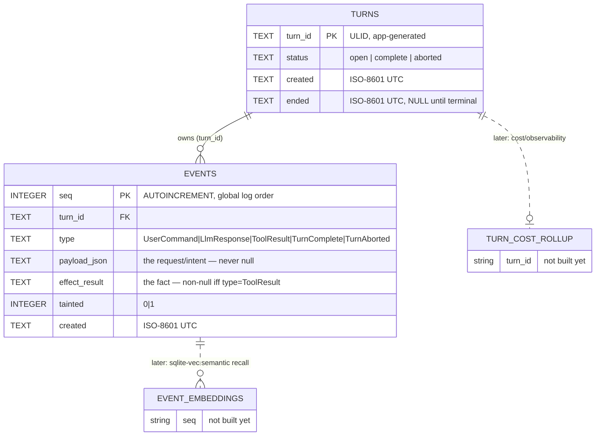

# Pythia — Event Log Data Model (Unit 2)

**Date:** 2026-07-10
**Status:** Design — feeds Unit 2 (Event log) of `docs/superpowers/specs/2026-07-10-pythia-engine-design.md`
**Scope:** SQLite/WAL event log for the first vertical slice only. No code, DDL/design only.

---

## 0. TL;DR

One SQLite file (WAL mode), two tables:

- **`turns`** — the aggregate root. One row per turn, mutated exactly twice (open → closed).
- **`events`** — the child entity. Append-only, immutable once written, enforced by trigger (SQLite
  has no column/row ACLs, so a `BEFORE UPDATE`/`BEFORE DELETE` trigger is the only DB-level way to
  hold the line — and it costs nothing).

Store choice re-affirmed, not re-litigated: SQLite/WAL is correct here for the same reasons Hermes'
`state.db` was correct — single-node, single-writer, embedded, zero ops, and the SQL surface pays
for itself again the moment cost rollups and time-travel debug land (§7). No alternative store
scored a hearing: this is operational log data with one writer and no cross-process fan-out in the
slice; Postgres would add a server dependency for zero benefit at this scale, and a plain file
(Hermes' `jobs.json` pattern) loses the ordered/queryable-by-index access patterns §2 requires.

---

## 1. ER diagram



Solid edge = enforced now. Dotted edges = named attach points only, deliberately unbuilt (§8).

---

## 2. DDL

```sql
-- Connection-level pragmas (set once per writer connection; app responsibility, not schema)
PRAGMA journal_mode = WAL;
PRAGMA foreign_keys = ON;
PRAGMA synchronous  = FULL;   -- see §6 — durability is a headline pillar, pay the fsync cost

-- ============================================================================
-- turns — aggregate root. Mutated exactly twice per lifecycle: open, then closed.
-- ============================================================================
CREATE TABLE turns (
    turn_id     TEXT PRIMARY KEY,                 -- ULID, app-generated (time-sortable, no coordination)
    status      TEXT NOT NULL DEFAULT 'open'
                    CHECK (status IN ('open', 'complete', 'aborted')),
    created     TEXT NOT NULL
                    DEFAULT (strftime('%Y-%m-%dT%H:%M:%fZ', 'now')),
    ended       TEXT NULL                          -- set atomically with the terminal event, see §6
);

-- At most one open turn in the slice (single CLI channel, sequential turns) — partial index
-- documents the invariant now and pays off the moment a second channel/cron exists.
CREATE INDEX idx_turns_open ON turns(status) WHERE status = 'open';

-- ============================================================================
-- events — child entity. Append-only. One row = one durable fact. Never updated, never deleted.
-- ============================================================================
CREATE TABLE events (
    seq             INTEGER PRIMARY KEY AUTOINCREMENT,  -- global monotonic log order; log tip = MAX(seq)
    turn_id         TEXT NOT NULL REFERENCES turns(turn_id),
    type            TEXT NOT NULL
                        CHECK (type IN (
                            'UserCommand',   -- turn input, kernel-authored from the CLI channel
                            'LlmResponse',   -- provider output: assistant text and/or a tool-call request
                            'ToolResult',    -- the effect: a completed tool/skill invocation OR a policy denial
                            'TurnComplete',  -- terminal marker, normal end
                            'TurnAborted'    -- terminal marker, abnormal end (crash-abandoned / hard error)
                        )),
    payload_json    TEXT NOT NULL
                        CHECK (json_valid(payload_json)),   -- the request/intent; feeds LLM context rebuild
    effect_result   TEXT NULL
                        CHECK (effect_result IS NULL OR json_valid(effect_result)),
    tainted         INTEGER NOT NULL DEFAULT 0
                        CHECK (tainted IN (0, 1)),
    created         TEXT NOT NULL
                        DEFAULT (strftime('%Y-%m-%dT%H:%M:%fZ', 'now')),

    -- THE REPLAY RULE AS A DATA INVARIANT (see §5):
    -- effect_result is non-null if and only if this row records a completed tool effect.
    -- No other event type may ever carry one; a ToolResult row is only ever inserted once its
    -- effect is fully known — there is no "pending" ToolResult row.
    CHECK (
        (type = 'ToolResult' AND effect_result IS NOT NULL)
        OR (type != 'ToolResult' AND effect_result IS NULL)
    )
);

-- ---- Immutability enforcement (integrity §6) ----
CREATE TRIGGER trg_events_no_update
BEFORE UPDATE ON events
BEGIN
    SELECT RAISE(ABORT, 'events are append-only: UPDATE forbidden');
END;

CREATE TRIGGER trg_events_no_delete
BEFORE DELETE ON events
BEGIN
    SELECT RAISE(ABORT, 'events are append-only: DELETE forbidden');
END;

-- ---- Indexes (mapped to access patterns in §3) ----

-- (a) rebuild turn history for the next LLM call — ordered slice per turn
CREATE INDEX idx_events_turn_seq ON events(turn_id, seq);

-- (b) find the log tip / last recorded effect for crash-resume — partial index over the
-- one event type that carries a completed side effect, so resume doesn't scan UserCommand/
-- LlmResponse rows to find "what already ran."
CREATE INDEX idx_events_tool_result ON events(turn_id, seq) WHERE type = 'ToolResult';

-- taint audit / policy pre-check — partial index over tainted rows only (§7)
CREATE INDEX idx_events_tainted ON events(turn_id, seq) WHERE tainted = 1;
```

---

## 3. Access patterns → indexes

| # | Access pattern | Query shape | Index used | Why this shape |
|---|---|---|---|---|
| (a) | Rebuild turn history / compacted slice for the next LLM call — **the cost lever** | `SELECT seq, type, payload_json, effect_result, tainted FROM events WHERE turn_id = ? ORDER BY seq` | `idx_events_turn_seq (turn_id, seq)` | `seq` is already global insertion order, so an index range scan on `(turn_id, seq)` returns the turn's events pre-sorted — no separate sort step. This is the query the kernel's context-compaction algorithm runs every LLM call; it must stay index-only for the ordering columns even as `payload_json` grows. |
| (b) | Find the log tip (crash-resume) | `SELECT seq FROM events ORDER BY seq DESC LIMIT 1` | none needed — `seq` **is** the rowid (INTEGER PRIMARY KEY), so this is an O(log n) rowid-btree seek by construction | Global tip, not per-turn — matches the single-open-turn invariant (§`idx_turns_open`) |
| (b) | Find last recorded effect for the (one) open turn | `SELECT * FROM events WHERE turn_id = ? AND type = 'ToolResult' ORDER BY seq DESC LIMIT 1` | `idx_events_tool_result (turn_id, seq) WHERE type='ToolResult'` | Resume needs to know "what's the last effect that actually happened" distinct from "what's the last thing logged" (which might be an `LlmResponse` still awaiting dispatch). Partial index skips every non-effect row. |
| (c) *(forward-compat, not built)* | Cost rollup per turn | would aggregate token/cost fields out of `payload_json`/`effect_result` for a turn | none yet | See §8 — lands as a rollup on `turns` or a child `turn_cost_rollup`, mirroring Hermes' denormalized session token columns. Not indexed now because the columns don't exist yet. |
| (c) *(forward-compat, not built)* | Time-travel debug — "state of the world as of seq N" | `SELECT * FROM events WHERE turn_id = ? AND seq <= ? ORDER BY seq` | already served by `idx_events_turn_seq` | No new index required — this access pattern is just a bounded variant of (a). Noted here so nobody re-designs it later. |

---

## 4. Event type enum — rationale

Five values, deliberately not more:

- `UserCommand`, `LlmResponse`, `ToolResult`, `TurnComplete` are named directly in the spec's data
  flow (§5 of the design doc). Kept as-is.
- `ToolResult` also carries **policy denials**, not just successes. When the Capability Host gates
  a request (§5 step 5 of the spec, "gate → allow/deny"), the denial is itself the recorded fact —
  `effect_result = {"status":"denied","reason":"..."}`. This avoids a `PolicyDenial` type: a denial
  is exactly as immutable and exactly as "never re-run" as a success, so it belongs under the same
  invariant (§5 below) rather than a parallel type with parallel rules. One fewer type, same
  guarantee — KISS breaks the tie.
- `TurnAborted` is the one addition beyond the literal sketch. `turns.status` needs a terminal value
  for the crash-abandoned / unrecoverable-error case (provider unreachable after retries, operator
  gives up on a turn) distinct from `complete`. Without a matching event type, `turns.status`
  could reach `'aborted'` with no durable record of why — a gap in the very invariant this schema
  exists to enforce (§6). It costs one enum value and closes that gap; not speculative scope creep.

No lookup table for event types: five fixed values behind a `CHECK` is simpler and exactly as
correct as a normalized `event_types` table, and ties break toward the simpler design (YAGNI/KISS).

---

## 5. Replay rule as a data invariant

**Rule (from the spec):** *An event with a recorded `effect_result` is a fact, never re-run.*

Formalized as the `CHECK` in §2:

```sql
CHECK (
    (type = 'ToolResult' AND effect_result IS NOT NULL)
    OR (type != 'ToolResult' AND effect_result IS NULL)
)
```

This makes "is this a completed side effect" a schema-checkable predicate, not a convention the
kernel has to get right by discipline alone. Two consequences fall out:

1. **No pending `ToolResult` rows.** A `ToolResult` event is inserted **once**, atomically, only
   after the tool/skill call has fully returned. There is no "dispatched, awaiting result" row to
   later update — which is also *why* the immutability trigger (§6) is safe to be unconditional:
   nothing ever legitimately needs to update a row.
2. **Resume is a pure read over `events`, keyed by `turns.status`.** Algorithm:
   - `SELECT turn_id FROM turns WHERE status = 'open'` — in the slice, zero or one row.
   - For that turn, `SELECT * FROM events WHERE turn_id = ? ORDER BY seq` (`idx_events_turn_seq`).
   - Walk the ordered rows. Every row already present is a fact — do not re-request it from the
     provider, do not re-invoke the tool. The kernel's state machine determines the *next* action
     purely from the shape of the last row (e.g., last row is `LlmResponse` carrying a tool-call
     request with no following `ToolResult` for it → next action is "dispatch that tool call";
     last row is a `ToolResult` → next action is "call the provider again with the extended
     context"). Nothing before the last row is ever re-executed.

**Residual risk, named rather than hidden:** the crash window between *the tool call actually
running in the outside world* and *the `ToolResult` INSERT committing to WAL* is real and is not
closed by this schema alone — no event-sourced log closes it for genuinely non-idempotent external
effects (send-email, charge-card) without an idempotency key at the receiving system. For the
slice's demo effect (`read_file`, side-effect-free to repeat) this window is harmless. Recommendation:
keep the window as small as possible (compute-the-result-then-insert, no intermediate state), and
treat **effect idempotency as a skill-author responsibility** declared in the skill manifest (Unit
3/4 concern) rather than adding kernel-side two-phase commit machinery now — that machinery is not
justified until a non-idempotent effect actually ships. Flagged for revisit when `send_email`-class
skills are built, not solved here.

---

## 6. Transactional boundary / DDD mapping

| Concept | Maps to | Invariant |
|---|---|---|
| **Aggregate root** | `Turn` → `turns` row | Owns a `turn_id`; the only two writes to this row are open (insert) and close (update `status`+`ended`). |
| **Child entity** | `Event` → `events` row | Identified by `seq`; belongs to exactly one turn via `turn_id` FK; immutable post-insert. |
| **Transactional boundary** | **Per-event, not per-turn** | This is the one place worth being precise: the spec phrase "the whole turn's events append within the durability guarantee" must **not** be read as "batch a turn's events into one transaction." Batching would break the crash-resume guarantee itself — the entire point is that a crash *between* two events must not lose the one that already committed. So: **every interior event (`LlmResponse`, `ToolResult`) is its own single-statement autocommit transaction**, durably fsynced (`synchronous=FULL`, WAL) before the kernel proceeds to the next step. The *turn* is the durability guarantee's unit of **meaning** (a turn is the thing you resume), not its unit of **commit**. |
| **Turn open** | `INSERT INTO turns (...)` + `INSERT INTO events (type='UserCommand', ...)` | Wrapped in one explicit transaction — a turn should never exist with a `UserCommand` event but no `turns` row, or vice versa. Two-statement, single commit. |
| **Turn close** | `UPDATE turns SET status=?, ended=? WHERE turn_id=?` + `INSERT INTO events (type IN ('TurnComplete','TurnAborted'), ...)` | Also one explicit transaction, for the same reason: `turns.status` must never diverge from the presence of its terminal event. |
| **Single writer** | One SQLite connection holds the write lock for the kernel process; WAL allows concurrent readers (diagnostics, future observability) without blocking the writer. | Matches Hermes' `state.db` concurrency model; the slice has exactly one writer by construction (single CLI channel, sequential turns), so there is no write contention to design around yet. |

Net effect: the aggregate boundary is enforced by **two narrow atomic transactions (open, close)**
bracketing a stream of **individually-durable single-row appends** — not one giant transaction per
turn. This is what actually satisfies both DDD ("one aggregate, one consistency boundary") and the
crash-resume requirement ("nothing already executed is lost or repeated") simultaneously; treating
them as the same transaction would have satisfied neither.

---

## 7. Taint — recording and querying

- **Recorded**: `events.tainted INTEGER NOT NULL DEFAULT 0 CHECK (tainted IN (0,1))`. Set by the
  kernel at insert time on any event whose payload originates from an untrusted source (web
  content, inbound message, tool output pulled from outside the sandbox) — per the spec's Unit 3
  invariant that the LLM and inbound content are untrusted.
- **Queried**: two shapes matter in the slice —
  1. *Policy pre-check* — "does this turn's history contain tainted data before a high-privilege
     tool call is granted?" — `SELECT 1 FROM events WHERE turn_id = ? AND tainted = 1 LIMIT 1`,
     served by `idx_events_tainted (turn_id, seq) WHERE tainted = 1` (skips every clean row).
  2. *Audit / time-travel* — "show me every tainted event in this turn" — same partial index,
     full scan of just the tainted subset, ordered by `seq`.
- **Out of scope here, flagged for the Capability Host design**: taint *propagation* (does a
  `LlmResponse` that consumed a tainted `ToolResult` inherit taint for policy purposes?) is a
  lattice/policy decision that belongs to Unit 3, not the schema. The schema only guarantees the
  fact is recorded and cheaply queryable per-row; propagation logic reads this column, it doesn't
  live in it.

---

## 8. Forward-compatible seams (explicitly NOT designed now)

Per the spec's Out-of-scope list (semantic memory, cost/observability beyond the seam) — these are
named attach points only, no DDL, no code:

- **Cost / observability rollups.** Attach point: either denormalized columns on `turns`
  (`input_tokens`, `output_tokens`, `cost_usd`, mirroring Hermes' `sessions` rollup pattern) or a
  1:1 child table `turn_cost_rollup(turn_id PK REFERENCES turns, ...)` populated by scanning
  `LlmResponse`/`ToolResult` payloads. Decision between the two is deferred to when the router
  (Axis A, deferred past the slice) exists and there's a real second provider to compare cost
  against — designing it now would be guessing at columns.
- **Semantic memory (sqlite-vec + FTS5).** Explicitly **not** an index over the raw `events` table.
  `events` is an operational replay log (facts about what happened), not a curated semantic
  recall corpus — conflating the two is the mistake Hermes avoided by keeping `MEMORY.md`/`USER.md`
  as a separate bounded context from `state.db`'s session log. When semantic recall is designed,
  expect a **separate table** (or separate virtual tables) with a foreign key back to `turn_id`/
  `seq` for provenance, not a vector column bolted onto `events`. Store-choice question (co-located
  in this same SQLite file via `sqlite-vec`, vs. a dedicated engine) is deferred to that design
  session, not decided here — see `docs/reference/hermes-data-architecture.md` §8 for the reasoning
  pattern to reuse (hybrid FTS+ANN via RRF, `sqlite-vec` before any server-grade vector DB).
- Both seams stay in the **same SQLite file** when built (one file to back up, WAL-aware
  `.backup`/`VACUUM INTO` — same operational discipline Hermes uses for `state.db`), unless a
  future constraint (multi-tenant, shared corpus) forces a split. Not a decision to make now.

---

## 9. Open items / residual risk (carried forward, not blocking)

- **In-doubt crash window** for non-idempotent tool effects (§5) — accepted as residual risk for
  the slice; revisit when a non-idempotent skill (e.g. `send_email`) is actually built.
- **`turn_id` generation** — ULID, app-generated by the kernel (SQLite has no native ULID/UUID
  function); time-sortable which is convenient for debugging but not load-bearing since `seq`
  is the real ordering key.
- **`created` as `TEXT` ISO-8601 vs `REAL` epoch** — chose `TEXT` ISO-8601 (UTC, millisecond
  precision) for human-readability during time-travel debugging, since `seq` already carries all
  ordering weight and `created` is display/debug-only. Revisit to `REAL` epoch only if a future
  analytics workload needs cheap arithmetic over timestamps at volume — not a concern in the slice.
- **`synchronous = FULL`** trades commit latency for power-loss durability, consistent with
  durability being one of the three named pillars of the project thesis. If per-event fsync
  latency becomes a measured problem, `NORMAL` (still crash-safe against process crash, not
  power loss) is the documented fallback — not adopted now, no evidence it's needed.
